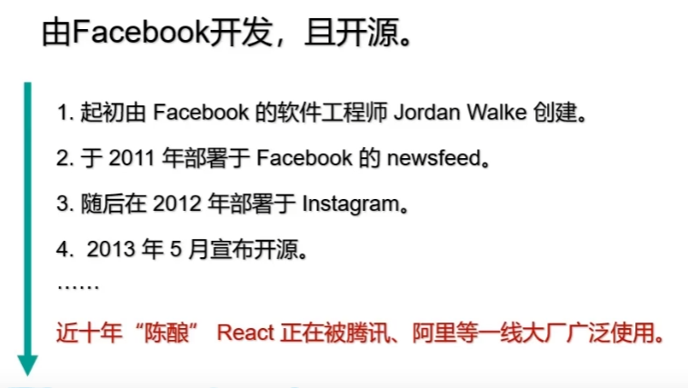
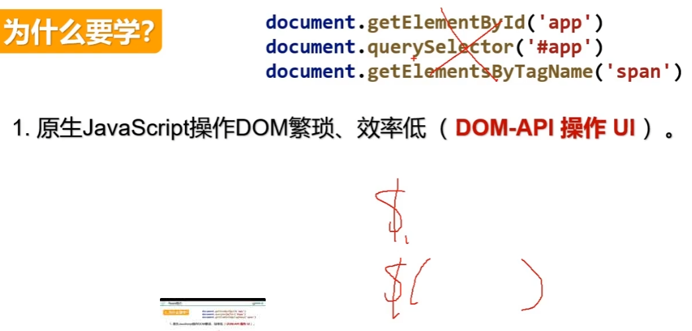
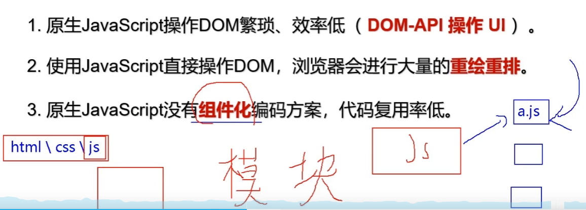
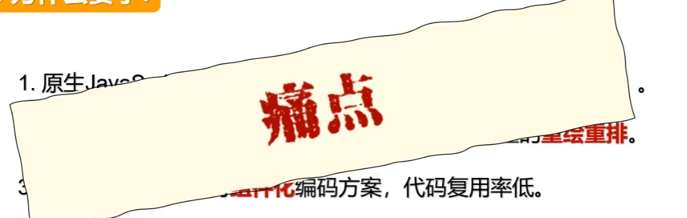
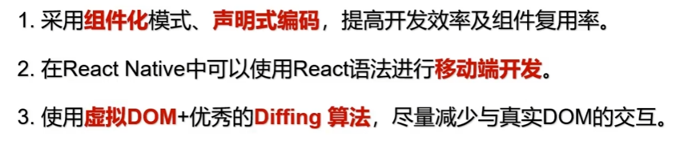

# 001_react简介

## 是什么

React 

用于构建用户界面的JavaScript库

1. 发送请求获取数据
1. 处理数据(过滤,整理格式等)
1. **操作DOM呈现页面**

React是一个数据渲染为HTML视图的开源js库

## 谁开发的?

由Facebook开发,且开源

## 3

## React特点

## 学习React之前你要掌握的JS基础知识

- 判断this的指向
- class类
- ES6语法规范
- npm包管理器
- 原型,原型链
- 数组常用方法
- 模块化
