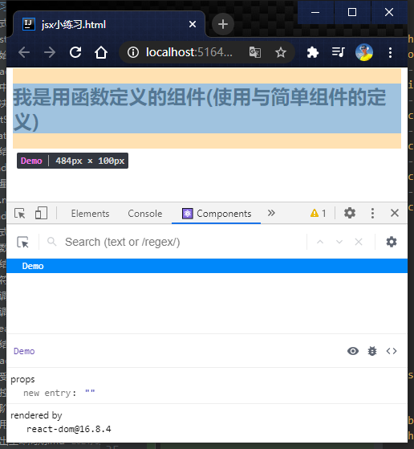
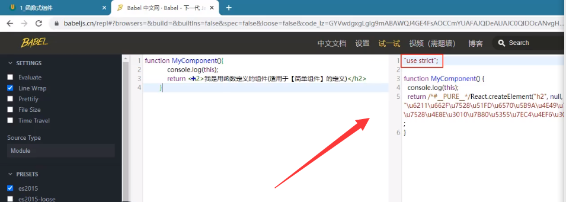

# 009_函数式组件.md


```html
<!doctype html>
<html lang="en">
<head>
    <meta charset="UTF-8">
    <meta name="viewport"
          content="width=device-width, user-scalable=no, initial-scale=1.0, maximum-scale=1.0, minimum-scale=1.0">
    <meta http-equiv="X-UA-Compatible" content="ie=edge">
    <title>jsx小练习.html</title>

</head>
<body>
<!--准备好一个"容器""-->
<div id="test"></div>
<!--引入 react 核心库-->
<script type="text/javascript" src="../js/react.development.js"></script>
<!--引入 react-dom ,用于支持react 操作Dom-->
<script type="text/javascript" src="../js/react-dom.development.js"></script>
<!--引入babel,用于将jsx转为js-->
<script type="text/javascript" src="../js/babel.min.js"></script>
<!--babel,表示是jsx-->
<script type="text/babel">
    // 1.创建函数式组件
    // 循序渐进, 先写个函数
    // 组件:包含页面局部功能全部代码和资源的集合
    function Demo() {
        //
        return <h2>我是用函数定义的组件(使用与简单组件的定义)</h2>
    }
    // 渲染组件到页面
    ReactDOM.render(<Demo/>,document.getElementById('test'))

</script>


</body>
</html>

```



```javascript
function MyComponent() {
        console.log(this);  // this 是 undefend
        // babel翻译完之后 开启严格模式
        // 严格模式 : 禁止this指向
        return <h2>我是用函数定义的组件(使用与简单组件的定义)</h2>
    }
    // 渲染组件到页面
    ReactDOM.render(<MyComponent/>,document.getElementById('test'))
/*
    * 执行了ReactDOM.render(<MyComponent/>...之后?发生了什么?
    *   1. React解析组件标签,找到了MyComponent组件.
    *   2. 发现组件是使用函数定义的,随后调用该函数,将返回的虚拟DOM转为真实DOM,随后呈现在页面中
    * */
```




>你写的jsx就是js的语法糖


