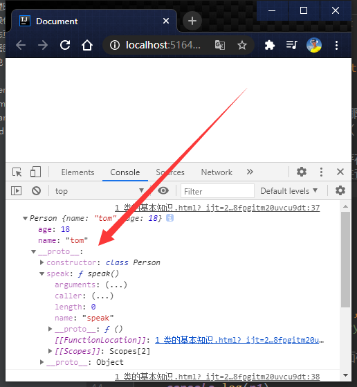
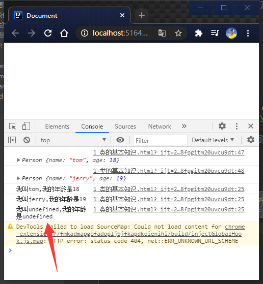

#  10_复习类相关知识

本来应该直接学类式组件的 

但是考虑你类都忘了


```html
<!doctype html>
<html lang="en">
<head>
    <meta charset="UTF-8">
    <meta name="viewport"
          content="width=device-width, user-scalable=no, initial-scale=1.0, maximum-scale=1.0, minimum-scale=1.0">
    <meta http-equiv="X-UA-Compatible" content="ie=edge">
    <title>Document</title>
</head>
<body>
<script type="application/javascript">
    // 你看白雪人间,你看冰川璀璨
    // 创建一个Person类
    class Person {
        // 构造方法 构造器
        constructor(name,age) {
            // this是类的实例对象
            this.name = name;
            this.age = age;
        }

        // 一般方法(处理 构造方法 都是一般方法
        speak() {
            // es6里面的模板语法
            console.log(`我叫${this.name},我的年龄是${this.age}`)
            // 思考1
            // speak方法放在 了哪里? - 类的原型对象 供实例使
            // (原型链的查找规则()
            // 当你调用了属性不存在的属性,后者不存在的方法
            // 那就要沿着原型链来查找,找下去

            // 思考2
            // this 是谁, 通过person 实例,调用speak时候,
            // speak中的this就是person实例本身
            // 这也不一定,call()方法有一个功能就是更改函数中的this指向,你传谁,就改成谁
        }

    }

    class Dog{}

    // 创建一个Person的实例对象
    const p1 = new Person('tom', 18);
    const p2 = new Person('jerry', 19);

    // 控制台输出的是实例,但是前面标记了一下这个实例时由谁来产生的
    console.log(p1)
    console.log(p2)


    p1.speak()
    p2.speak()
    p1.speak.call({a:1,b:2})
    // 这样就要看是函数是怎么调用的

</script>
</body>
</html>
```




