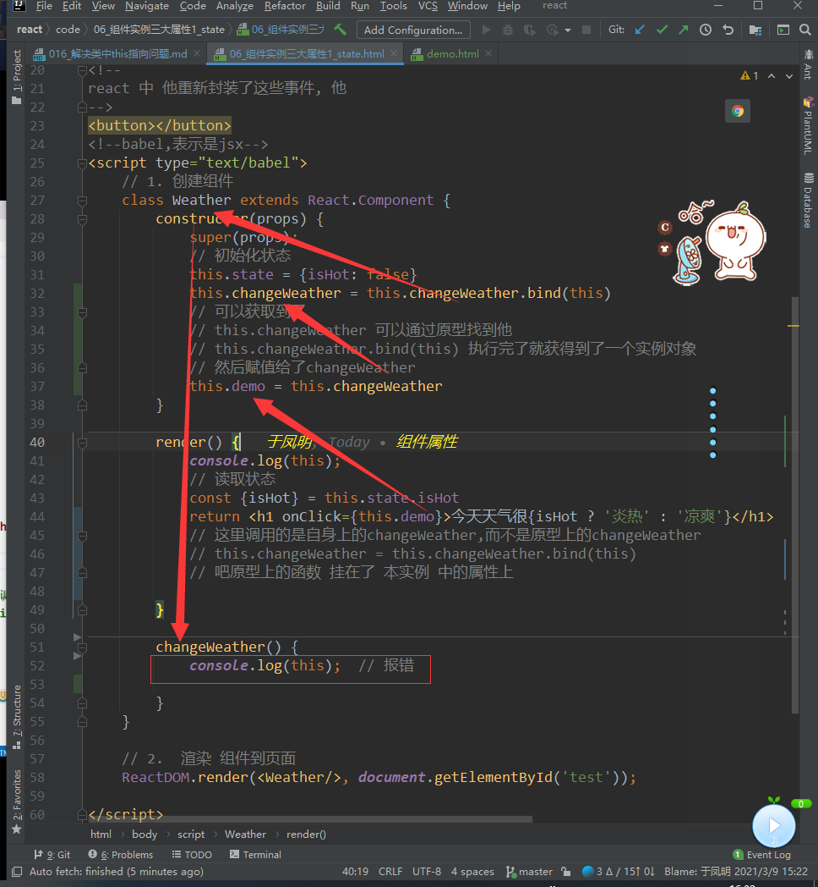

# 016_解决类中this指向问题

加一句话就能解决问题


> this.changeWeather = this.changeWeather.bind(this)


```html
<!doctype html>
<html lang="en">
<head>
    <meta charset="UTF-8">
    <meta name="viewport"
          content="width=device-width, user-scalable=no, initial-scale=1.0, maximum-scale=1.0, minimum-scale=1.0">
    <meta http-equiv="X-UA-Compatible" content="ie=edge">
    <title>06_组件实例三大属性1_state.html.html.html</title>
    <!--引入 react 核心库-->

    <script type="text/javascript" src="../js/react.development.js"></script>
    <!--引入 react-dom ,用于支持react 操作Dom-->
    <script type="text/javascript" src="../js/react-dom.development.js"></script>
    <!--引入babel,用于将jsx转为js-->
    <script type="text/javascript" src="../js/babel.min.js"></script>
</head>
<body>
<!--准备好一个"容器""-->
<div id="test"></div>
<!--
react 中 他重新封装了这些事件, 他
-->
<button></button>
<!--babel,表示是jsx-->
<script type="text/babel">
    // 1. 创建组件
    class Weather extends React.Component {
        constructor(props) {
            super(props);
            // 初始化状态
            this.state = {isHot: false}
            this.changeWeather = this.changeWeather.bind(this)
            // 可以获取到了
            // this.changeWeather 可以通过原型找到他
            // this.changeWeather.bind(this) 执行完了就获得到了一个实例对象
            // 然后赋值给了changeWeather
        }

        render() {
            console.log(this);
            // 读取状态
            const {isHot} = this.state.isHot
            return <h1 onClick={this.changeWeather}>今天天气很{isHot ? '炎热' : '凉爽'}</h1>
            // 这里调用的是自身上的changeWeather,而不是原型上的changeWeather
            // this.changeWeather = this.changeWeather.bind(this)
            // 吧原型上的函数 挂在了 本实例 中的属性上

        }

        changeWeather() {
            console.log(this);  // 报错
           /*
            * Weather {props: {…}, context: {…}, refs: {…}, updater: {…}, state: {…}, …}
            changeWeather: ƒ ()
            context: {}
            props: {}
            refs: {}
            state: {isHot: false}
            updater: {isMounted: ƒ, enqueueSetState: ƒ, enqueueReplaceState: ƒ, enqueueForceUpdate: ƒ}
            _reactInternalFiber: FiberNode {tag: 1, key: null, stateNode: Weather, elementType: ƒ, type: ƒ, …}
            _reactInternalInstance: {_processChildContext: ƒ}
            isMounted: (...)
            replaceState: (...)
            __proto__: Component
            * */
        }
    }

    // 2.  渲染 组件到页面
    ReactDOM.render(<Weather/>, document.getElementById('test'));

</script>


</body>
</html>

```


```javascript

function demo() {
    console.log(this);
}

demo();
demo.bind({a:1,b:2})
// 现在什么也么有
const d =     demo.bind({a:1,b:2})
d();
// 这样才行

```


>return <h1 onClick={this.changeWeather}>今天天气很{isHot ? '炎热' : '凉爽'}</h1>
>

这个指定的还是原型上的函数

所以还要改一下





```javascript
// 1. 创建组件
class Weather extends React.Component {
    constructor(props) {
        super(props);
        // 初始化状态
        this.state = {isHot: false}
        this.changeWeather = this.changeWeather.bind(this)
        // 可以获取到了
        // this.changeWeather 可以通过原型找到他
        // this.changeWeather.bind(this) 执行完了就获得到了一个实例对象
        // 然后赋值给了changeWeather
        this.demo = this.changeWeather
        // 解决changeWeather 指向的问题
    }

    render() {
        console.log(this);
        // 读取状态
        const {isHot} = this.state.isHot
        return <h1 onClick={this.demo}>今天天气很{isHot ? '炎热' : '凉爽'}</h1>
        // 这里调用的是自身上的changeWeather,而不是原型上的changeWeather
        // this.changeWeather = this.changeWeather.bind(this)
        // 吧原型上的函数 挂在了 本实例 中的属性上

    }

    changeWeather() {
        console.log(this);  // 报错

    }
}

// 2.  渲染 组件到页面
ReactDOM.render(<Weather/>, document.getElementById('test'));

```