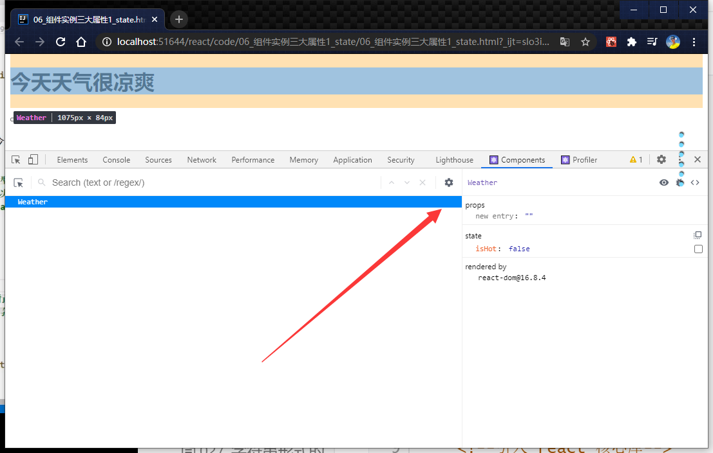

# 017_setState的使用


这样就实现了
```html
<!doctype html>
<html lang="en">
<head>
    <meta charset="UTF-8">
    <meta name="viewport"
          content="width=device-width, user-scalable=no, initial-scale=1.0, maximum-scale=1.0, minimum-scale=1.0">
    <meta http-equiv="X-UA-Compatible" content="ie=edge">
    <title>06_组件实例三大属性1_state.html.html.html</title>
    <!--引入 react 核心库-->

    <script type="text/javascript" src="../js/react.development.js"></script>
    <!--引入 react-dom ,用于支持react 操作Dom-->
    <script type="text/javascript" src="../js/react-dom.development.js"></script>
    <!--引入babel,用于将jsx转为js-->
    <script type="text/javascript" src="../js/babel.min.js"></script>
</head>
<body>
<!--准备好一个"容器""-->
<div id="test"></div>
<!--
react 中 他重新封装了这些事件, 他
-->
<button></button>
<!--babel,表示是jsx-->
<script type="text/babel">
    // 1. 创建组件
    class Weather extends React.Component {
        constructor(props) {
            super(props);
            // 初始化状态
            this.state = {isHot: false}
            this.changeWeather = this.changeWeather.bind(this)
            // 可以获取到了
            // this.changeWeather 可以通过原型找到他
            // this.changeWeather.bind(this) 执行完了就获得到了一个实例对象
            // 然后赋值给了changeWeather
            this.demo = this.changeWeather
            // 解决changeWeather 指向的问题
        }

        render() {
            console.log(this);
            // 读取状态
            const {isHot} = this.state
            return <h1 onClick={this.demo}>今天天气很{isHot ? '炎热' : '凉爽'}</h1>
            // 这里调用的是自身上的changeWeather,而不是原型上的changeWeather
            // this.changeWeather = this.changeWeather.bind(this)
            // 吧原型上的函数 挂在了 本实例 中的属性上

        }

        changeWeather() {
            console.log(this);  // 报错
            // 获取原来的isHot值
            const isHot = this.state.isHot
            // 严重注意: 状态(state)不可直接更改,下面这行就是直接更改!!!
            // this.state.isHot = !isHot|;   // 这是错误的写法
            // 严重注意!   : 状态必须使用 setState 来修改
            this.setState({isHot:!isHot});   // 这是错误的写法
            console.log(this.state.isHot);
            // 这里面改成了,布尔值已经完成切换了
        }
    }

    // 2.  渲染 组件到页面
    ReactDOM.render(<Weather/>, document.getElementById('test'));

</script>


</body>
</html>

```

