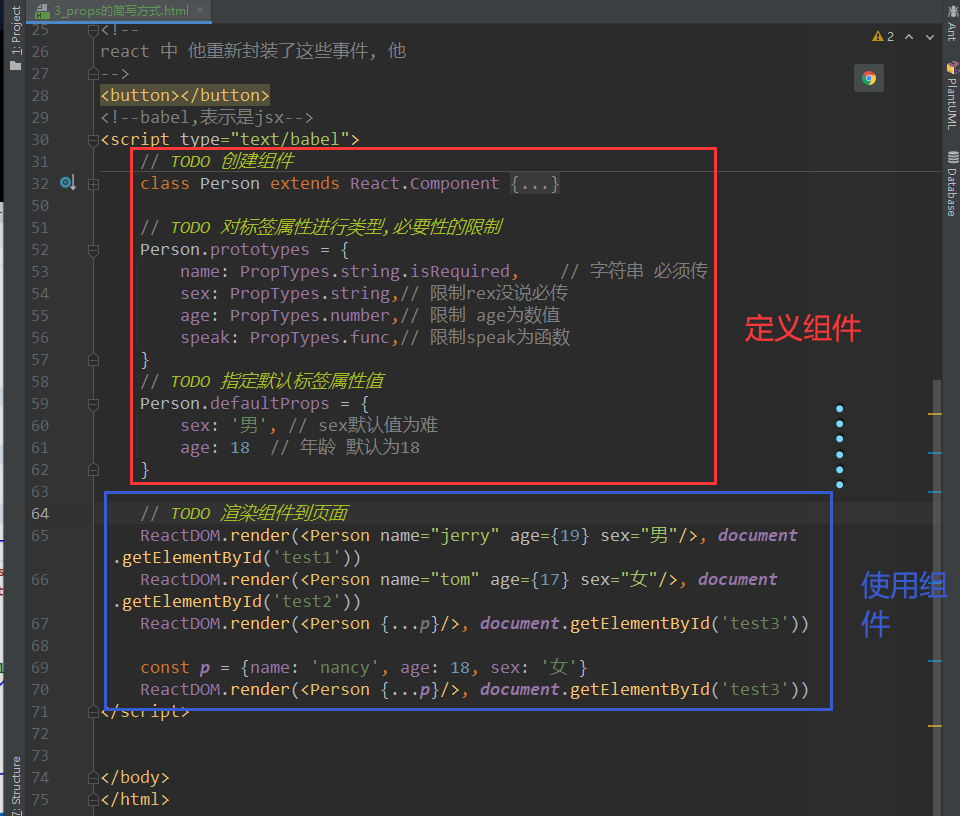
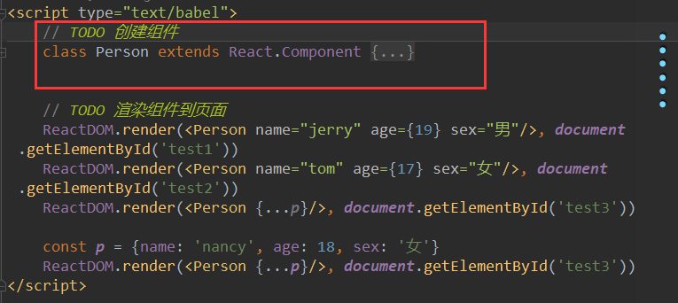

# 023_props的简写方式



问题分析

>你定义的Person类
>
>还要在外面来进行属性的限制
>
>这就不太好
>
>看看能不能放到里面

```javascript
// TODO 创建组件
class Person extends React.Component {
    state = {name: 'tom', age: "18", sex: "女"}

    render() {
        const {name, age, sex} = this.props
        // props 是只读的
        this.props.name = 'jack'    // 此行代码会报错,因为props是支队的
        // 从组建外部 来给他信息,也就是不能用state 来给他数据信息
        return (
            <ul>
                <li>姓名: {name}</li>
                <li>姓别: {sex}</li>
                <li>年龄: {age + 1}</li>
            </ul>
        )
        // <li>年龄: {age + 1}</li> 这个不算修改,只是一个运算,只有读的过程
    }

    // TODO 对标签属性进行类型,必要性的限制
    static prototypes = {
        name: PropTypes.string.isRequired,    // 字符串 必须传
        sex: PropTypes.string,// 限制rex没说必传
        age: PropTypes.number,// 限制 age为数值
        speak: PropTypes.func,// 限制speak为函数
    }
    // TODO 指定默认标签属性值
    static defaultProps = {
        sex: '男', // sex默认值为难
        age: 18  // 年龄 默认为18
    }

}


// TODO 渲染组件到页面
ReactDOM.render(<Person name="jerry" age={19} sex="男"/>, document.getElementById('test1'))
ReactDOM.render(<Person name="tom" age={17} sex="女"/>, document.getElementById('test2'))
ReactDOM.render(<Person {...p}/>, document.getElementById('test3'))

const p = {name: 'nancy', age: 18, sex: '女'}
ReactDOM.render(<Person {...p}/>, document.getElementById('test3'))
```

> 这不就写在里面了么



> 现在这个类一折叠就清晰了不少了

> 和类相关的东西都放到了类里面


