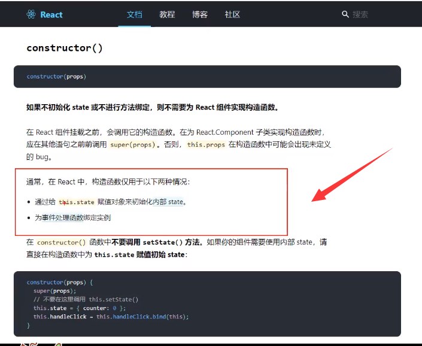

# 024_类式组件中的构造器与




```javascript
// TODO 创建组件
class Person extends React.Component {
    state = {name: 'tom', age: "18", sex: "女"}

    constructor(props) {
        // 构造器 是否接受props,石佛语传递给super,取决于:
        // 1. 是否希望在构造器中通过this访问props
        // 但是这种情况及其少见
        super(props);
        // ??? 这个地方我传递给super()props属性
        // 构造器科协可不写
        console.log('constructor', this.props)
        // 如果我需要用this.props 也可以 直接props
        // props 有被传进来的,

        
    }

    // TODO 对标签属性进行类型,必要性的限制
    static prototypes = {
        name: PropTypes.string.isRequired,    // 字符串 必须传
        sex: PropTypes.string,// 限制rex没说必传
        age: PropTypes.number,// 限制 age为数值
        speak: PropTypes.func,// 限制speak为函数
    }
    // TODO 指定默认标签属性值
    static defaultProps = {
        sex: '男', // sex默认值为难
        age: 18  // 年龄 默认为18
    }

    render() {
        const {name, age, sex} = this.props
        // props 是只读的
        this.props.name = 'jack'    // 此行代码会报错,因为props是支队的
        // 从组建外部 来给他信息,也就是不能用state 来给他数据信息
        return (
            <ul>
                <li>姓名: {name}</li>
                <li>姓别: {sex}</li>
                <li>年龄: {age + 1}</li>
            </ul>
        )
        // <li>年龄: {age + 1}</li> 这个不算修改,只是一个运算,只有读的过程
    }

}


// TODO 渲染组件到页面
ReactDOM.render(<Person name="jerry" age={19} sex="男"/>, document.getElementById('test1'))
```