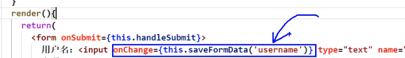

# 035_高阶函数_函数柯里化


问题引出

你觉不觉得之前的有用瑕疵

如果这个不是登录而是注册

那username/password .... 就多了



>这个是将saveFormData()的返回值作为回调


> 弹幕: 你秒任你秒,还是`v-model`好用


## 复习
```html
<!DOCTYPE html>
<html>
	<head>
		<meta charset="UTF-8" />
		<title>Document</title>
	</head>
	<body>
		<script type="text/javascript" >
			let a = 'name'

			let obj = {} // {name:'tom'}
			obj[a] = 'tom'
			console.log(obj);
			
		</script>
	</body>
</html>
```

>方括号的用法
>

```javascript
//#region
/*
高阶函数：如果一个函数符合下面2个规范中的任何一个，那该函数就是高阶函数。
                1.若A函数，接收的参数是一个函数，那么A就可以称之为高阶函数。
                2.若A函数，调用的返回值依然是一个函数，那么A就可以称之为高阶函数。
                常见的高阶函数有：Promise、setTimeout、arr.map()等等

函数的柯里化：通过函数调用继续返回函数的方式，实现多次接收参数最后统一处理的函数编码形式。
    function sum(a){
        return(b)=>{
            return (c)=>{
                return a+b+c
            }
        }
    }
    */
//#endregion
//创建组件
class Login extends React.Component {
    //初始化状态
    state = {
        username: '', //用户名
        password: '' //密码
    }
    //保存表单数据到状态中
    saveFormData = (dataType) => {
        // 又套了一层, 这样能够将参数传进来
        // 这个能叫闭包吧!!!
        return (event) => {
            this.setState({[dataType]: event.target.value})
        }
    }
    //表单提交的回调
    handleSubmit = (event) => {
        event.preventDefault() //阻止表单提交
        const {username, password} = this.state
        alert(`你输入的用户名是：${username},你输入的密码是：${password}`)
    }

    render() {
        return (
            <form onSubmit={this.handleSubmit}>
                用户名：<input onChange={this.saveFormData('username')} type="text" name="username"/>
                密码：<input onChange={this.saveFormData('password')} type="password" name="password"/>
                <button>登录</button>
            </form>
        )
    }
}

//渲染组件
ReactDOM.render(<Login/>, document.getElementById('test'))
```

>不要纠结有没有小括号,核心是你要将一个函数交给回调
>


>//#region 加这个东西就能够折叠了