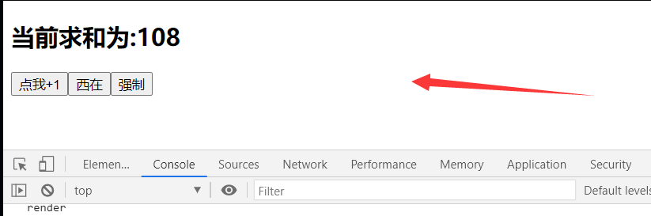
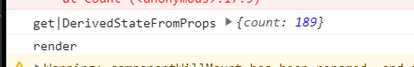

# 044_getDerivedStateFromProps


`getDerivedStateFromProps`翻译为`获取派生状态从props中`

## 然后开始测试

你家这么一行代码

```javascript
getDerivedStateFromProps() {
    // 如果当真
    console.log("getDerivedStateFromProps");
}
```

> 然后就有警告了

```
Warning: Count: getDerivedStateFromProps() is defined as an instance method and will be ignored. Instead, declare it as a static method.
    at Count (<anonymous>:17:9)
```

> 说明这个钩子不应该给实例用

```javascript
static getDerivedStateFromProps() {
    // 如果当真
    console.log("getDerivedStateFromProps");
}
```

> 现在报警告这个

```
Warning: Count.getDerivedStateFromProps(): A valid state object (or null) must be returned. You have returned undefined.
    at Count (<anonymous>:17:9)
```

> 就是说
>
> 你必须要给我返回, 1. 返回状态对象 2, 返回 null 
>
> 然而你现在返回 undefined 就不行

代码成这样了

```javascript
static getDerivedStateFromProps() {
    // 如果当真
    console.log("get|DerivedStateFromProps");
    return null;
}
```

> 那他让我返回状态对象
>
> 我就按他说的来


```javascript
static getDerivedStateFromProps() {
    // 如果当真
    console.log("get|DerivedStateFromProps");
    return {count:108};
}
```


然后你会发现你的页面



也就是说这个函数的返回值能够指定状态,但是我现在+1 坏了

换句话说,你这个一单返回这个状态对象,他就不能更改了,(状态更新失效)

> 所以什么是派生?

```javascript
static getDerivedStateFromProps(props) {
    // 如果当真
    console.log("get|DerivedStateFromProps",props);
    return {count:108};
}
```

现在打印是空

那我要是给

```javascript
//渲染组件
    ReactDOM.render(<Count count={189}/>, document.getElementById('test'))
```




> 在这个函数里面 把 props 返回了,所以说,这个props就当成了 状态用了

什么时候用?呢,看一下[官方](https://react.docschina.org/docs/react-component.html#static-getderivedstatefromprops)说的

 `getDerivedStateFromProps` 会在调用 render 方法之前调用，并且在初始挂载及后续更新时都会被调用。它应返回一个对象来更新 state，如果返回 null 则不更新任何内容。 

 此方法适用于[罕见的用例](https://react.docschina.org/blog/2018/06/07/you-probably-dont-need-derived-state.html#when-to-use-derived-state)，即 state 的值在任何时候都取决于 props。例如，实现 `` 组件可能很方便，该组件会比较当前组件与下一组件，以决定针对哪些组件进行转场动画。 

> 你只要把上述代码加上后,你的状态在任何时候都等于props,那也就是你的更改啊,什么+1啊都失去效果了

派生状态会导致代码冗余，并使组件难以维护。 [确保你已熟悉这些简单的替代方案：](https://react.docschina.org/blog/2018/06/07/you-probably-dont-need-derived-state.html)

- 如果你需要**执行副作用**（例如，数据提取或动画）以响应 props 中的更改，请改用 [`componentDidUpdate`](https://react.docschina.org/docs/react-component.html#componentdidupdate)。
- 如果只想在 **prop 更改时重新计算某些数据**，[请使用 memoization helper 代替](https://react.docschina.org/blog/2018/06/07/you-probably-dont-need-derived-state.html#what-about-memoization)。
- 如果你想**在 prop 更改时“重置”某些 state**，请考虑使组件[完全受控](https://react.docschina.org/blog/2018/06/07/you-probably-dont-need-derived-state.html#recommendation-fully-controlled-component)或[使用 `key` 使组件完全不受控](https://react.docschina.org/blog/2018/06/07/you-probably-dont-need-derived-state.html#recommendation-fully-uncontrolled-component-with-a-key) 代替。

## 一句话

了解即可

```javascript
static getDerivedStateFromProps(props,state) {
    // 如果当真
    console.log("get|DerivedStateFromProps",props,state);
    return {count:108};
}
```

