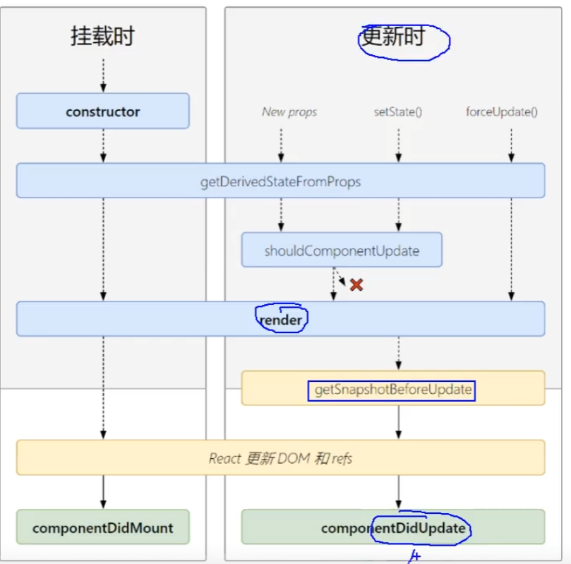
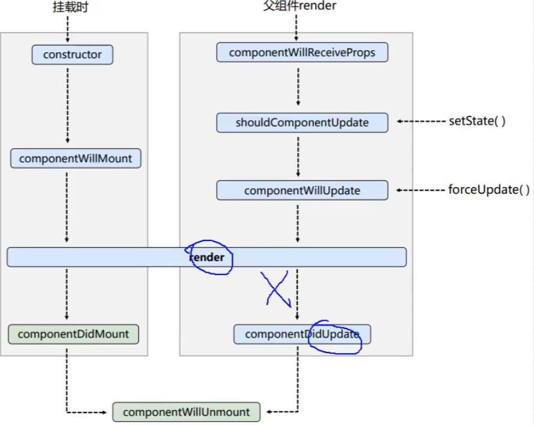

# 045 getSnapshotBeforeUpdate

`getSnapshotBeforeUpdate`比之前内个有点儿意义,刚才内个内写完了还违背了一些原则,有搭建了一些环境才搞出来了,然后还引发出了一些问题,就就就 ... 就™离谱

## 看一下新的图



## 旧的图




我先把上一个函数 ,让他返回null,但是我还不给他删除掉,不然你总是感觉没有走式的

```javascript
static getDerivedStateFromProps(props,state) {
    // 如果当真
    console.log("get|DerivedStateFromProps",props,state);
    return null;
}
```

## 翻译

Snapshot ==> 快照

getSnapshotBeforeUpdate ===> 在更新之前获取快照

