

    
<b>React</b><b>全家桶</b><b>(</b><b>技术栈</b><b>)</b><b><o:p></o:p></b>

    
尚硅谷前端研究院<o:p></o:p>

    
<b>第</b><b>1</b><b>章：</b><b>React</b><b>入门</b><b><o:p></o:p></b>

    <h2 style="margin-left:0.0000pt;text-indent:0.0000pt;mso-list:l0 level2 lfo1;"><![if !supportLists]>1.1.&nbsp;<![endif]><b>React</b><b>简介</b><b><o:p></o:p></b></h2>
    
<![if !supportLists]>1.1.1.&nbsp;<![endif]><b>官网</b><b><o:p></o:p></b>

    
<![if !supportLists]>1.&nbsp;<![endif]>英文官网:<a href="https://reactjs.org/">&nbsp;https://reactjs.org/</a><o:p></o:p>

    
<![if !supportLists]>2.&nbsp;<![endif]>中文官网:&nbsp;https://react.docschina.org/<o:p></o:p>

    
<![if !supportLists]>1.1.2.&nbsp;<![endif]><b>介绍描述</b><b><o:p></o:p></b>

    
<![if !supportLists]>1.&nbsp;<![endif]>用于动态构建用户界面的&nbsp;JavaScript 库(只关注于视图)<o:p></o:p>

    
<![if !supportLists]>2.&nbsp;<![endif]>由Facebook开源<o:p></o:p>

    
<![if !supportLists]>1.1.3.&nbsp;<![endif]><b>React</b><b>的特点</b><b><o:p></o:p></b>

    
<![if !supportLists]>1.&nbsp;<![endif]>声明式编码<o:p></o:p>

    
<![if !supportLists]>2.&nbsp;<![endif]>组件化编码<o:p></o:p>

    
<![if !supportLists]>3.&nbsp;<![endif]>React Native 编写原生应用<o:p></o:p>

    
<![if !supportLists]>4.&nbsp;<![endif]>高效（优秀的Diffing算法）<o:p></o:p>

    
<![if !supportLists]>1.1.4.&nbsp;<![endif]><b>React</b><b>高效的原因</b><b><o:p></o:p></b>

    
<![if !supportLists]>1.&nbsp;<![endif]>使用虚拟(virtual)DOM, 不总是直接操作页面真实DOM。<o:p></o:p>

    
<![if !supportLists]>2.&nbsp;<![endif]>DOM Diffing算法, 最小化页面重绘。<o:p></o:p>

    <h2 style="margin-left:0.0000pt;text-indent:0.0000pt;mso-list:l0 level2 lfo1;"><![if !supportLists]>1.2.&nbsp;<![endif]><b>React</b><b>的基本使用</b><b><o:p></o:p></b></h2>
    <h3 style="margin-left:0.0000pt;text-indent:0.0000pt;mso-list:l0 level3 lfo1;"><![if !supportLists]>1.2.1.&nbsp;<![endif]><b>效果</b><b><o:p></o:p></b></h3>
    
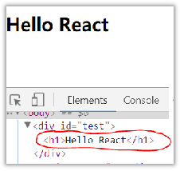<o:p>&nbsp;</o:p>

    <h3 style="margin-left:0.0000pt;text-indent:0.0000pt;mso-list:l0 level3 lfo1;"><![if !supportLists]>1.2.2.&nbsp;<![endif]><b>相关</b><b>js</b><b>库</b><b><o:p></o:p></b></h3>
    
<![if !supportLists]>1.&nbsp;<![endif]>react.js：React核心库。<o:p></o:p>

    
<![if !supportLists]>2.&nbsp;<![endif]>react-dom.js：提供操作DOM的react扩展库。<o:p></o:p>

    
<![if !supportLists]>3.&nbsp;<![endif]>babel.min.js：解析JSX语法代码转为JS代码的库。<o:p></o:p>

    <h3 style="margin-left:0.0000pt;text-indent:0.0000pt;mso-list:l0 level3 lfo1;"><![if !supportLists]>1.2.3.&nbsp;<![endif]><b>创建虚拟</b><b>DOM</b><b>的两种方式</b><b><o:p></o:p></b></h3>
    
<o:p>&nbsp;</o:p>

    
<![if !supportLists]>1.&nbsp;<![endif]>纯JS方式(一般不用)<o:p></o:p>

    
<![if !supportLists]>2.&nbsp;<![endif]>JSX方式<o:p></o:p>

    <h3 style="margin-left:0.0000pt;text-indent:0.0000pt;mso-list:l0 level3 lfo1;"><![if !supportLists]>1.2.4.&nbsp;<![endif]><b>虚拟</b><b>DOM</b><b>与真实DOM</b><b><o:p></o:p></b></h3>
    
<![if !supportLists]>1.&nbsp;<![endif]>React提供了一些API来创建一种&nbsp;&#8220;特别&#8221;&nbsp;的一般js对象<o:p></o:p>

    
<![if !supportLists]>&#108;&nbsp;<![endif]><b>const</b><b>&#160;</b><b>VDOM</b><b>&#160;=&#160;</b><b>React</b><b>.</b><b>createElement</b><b>(</b><b>'xx'</b><b>,{</b><b>id:</b><b>'xx'</b><b>},</b><b>'xx'</b><b>)</b><o:p></o:p>

    
<![if !supportLists]>&#108;&nbsp;<![endif]>上面创建的就是一个简单的虚拟DOM对象<o:p></o:p>

    
<![if !supportLists]>2.&nbsp;<![endif]>虚拟DOM对象最终都会被React转换为真实的DOM<o:p></o:p>

    
<![if !supportLists]>3.&nbsp;<![endif]>我们编码时基本只需要操作react的虚拟DOM相关数据, react会转换为真实DOM变化而更新界。<o:p></o:p>

    <h2 style="margin-left:0.0000pt;text-indent:0.0000pt;mso-list:l0 level2 lfo1;"><![if !supportLists]>1.3.&nbsp;<![endif]><b>React JSX</b><b><o:p></o:p></b></h2>
    <h3 style="margin-left:0.0000pt;text-indent:0.0000pt;mso-list:l0 level3 lfo1;"><![if !supportLists]>1.3.1.&nbsp;<![endif]><b>效果</b><b><o:p></o:p></b></h3>
    
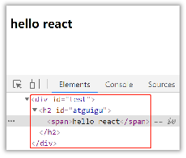<o:p>&nbsp;</o:p>

    <h3 style="margin-left:0.0000pt;text-indent:0.0000pt;mso-list:l0 level3 lfo1;"><![if !supportLists]>1.3.2.&nbsp;<![endif]><b>JSX</b><b><o:p></o:p></b></h3>
    
<![if !supportLists]>1.&nbsp;<![endif]>全称: &nbsp;JavaScript XML<o:p></o:p>

    
<![if !supportLists]>2.&nbsp;<![endif]>react定义的一种类似于XML的JS扩展语法: JS +&nbsp;XML本质是<b>React</b><b>.</b><b>createElement</b><b>(</b><b>component</b><b>,&#160;</b><b>props</b><b>,&#160;...</b><b>children</b><b>)</b>方法的语法糖<o:p></o:p>

    
<![if !supportLists]>3.&nbsp;<![endif]>作用: 用来简化创建虚拟DOM <o:p></o:p>

    
<![if !supportLists]>1)&nbsp;<![endif]>写法：<b>var</b><b>&#160;</b><b>ele</b><b>&#160;=&#160;</b><b>&#60;h1&#62;</b><b>Hello&#160;JSX!</b><b>&#60;/h1&#62;</b><o:p></o:p>

    
<![if !supportLists]>2)&nbsp;<![endif]>注意1：它不是字符串, 也不是HTML/XML标签<o:p></o:p>

    
<![if !supportLists]>3)&nbsp;<![endif]>注意2：它最终产生的就是一个JS对象<o:p></o:p>

    
<![if !supportLists]>4.&nbsp;<![endif]>标签名任意: HTML标签或其它标签<o:p></o:p>

    
<![if !supportLists]>5.&nbsp;<![endif]>标签属性任意: HTML标签属性或其它<o:p></o:p>

    
<![if !supportLists]>6.&nbsp;<![endif]>基本语法规则<o:p></o:p>

    
<![if !supportLists]>1)&nbsp;<![endif]>遇到&nbsp;&#60;开头的代码, 以标签的语法解析: html同名标签转换为html同名元素, 其它标签需要特别解析<o:p></o:p>

    
<![if !supportLists]>2)&nbsp;<![endif]>遇到以&nbsp;{ 开头的代码，以JS语法解析: 标签中的js表达式必须用{ }包含<o:p></o:p>

    
<![if !supportLists]>7.&nbsp;<![endif]>babel.js的作用<o:p></o:p>

    
<![if !supportLists]>1)&nbsp;<![endif]>浏览器不能直接解析JSX代码, 需要babel转译为纯JS的代码才能运行<o:p></o:p>

    
<![if !supportLists]>2)&nbsp;<![endif]>只要用了JSX，都要加上type="text/babel", 声明需要babel来处理<o:p></o:p>

    <h3 style="margin-left:0.0000pt;text-indent:0.0000pt;mso-list:l0 level3 lfo1;"><![if !supportLists]>1.3.3.&nbsp;<![endif]><b>渲染虚拟</b><b>DOM(</b><b>元素</b><b>)</b><b><o:p></o:p></b></h3>
    
<![if !supportLists]>1.&nbsp;<![endif]>语法: &nbsp;<b>ReactDOM</b><b>.</b><b>render</b><b>(</b><b>virtualDOM</b><b>,&#160;</b><b>containerDOM</b><b>)</b><o:p></o:p>

    
<![if !supportLists]>2.&nbsp;<![endif]>作用: 将虚拟DOM元素渲染到页面中的真实容器DOM中显示<o:p></o:p>

    
<![if !supportLists]>3.&nbsp;<![endif]>参数说明<o:p></o:p>

    
<![if !supportLists]>1)&nbsp;<![endif]>参数一: 纯js或jsx创建的虚拟dom对象<o:p></o:p>

    
<![if !supportLists]>2)&nbsp;<![endif]>参数二: 用来包含虚拟DOM元素的真实dom元素对象(一般是一个div)<o:p></o:p>

    <h3 style="margin-left:0.0000pt;text-indent:0.0000pt;mso-list:l0 level3 lfo1;"><![if !supportLists]>1.3.4.&nbsp;<![endif]><b>JSX</b><b>练习</b><b><o:p></o:p></b></h3>
    
需求: 动态展示如下列表<o:p></o:p>

    
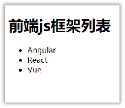<i><o:p>&nbsp;</o:p></i>

    <h2 style="margin-left:0.0000pt;text-indent:0.0000pt;mso-list:l0 level2 lfo1;"><![if !supportLists]>1.4.&nbsp;<![endif]><b>模块与组件、模块化与组件化的理解</b><b><o:p></o:p></b></h2>
    <h3 style="margin-left:0.0000pt;text-indent:0.0000pt;mso-list:l0 level3 lfo1;"><![if !supportLists]>1.4.1.&nbsp;<![endif]><b>模块</b><b><o:p></o:p></b></h3>
    
<![if !supportLists]>1.&nbsp;<![endif]>理解：向外提供特定功能的js程序, 一般就是一个js文件<o:p></o:p>

    
<![if !supportLists]>2.&nbsp;<![endif]>为什么要拆成模块：随着业务逻辑增加，代码越来越多且复杂。<o:p></o:p>

    
<![if !supportLists]>3.&nbsp;<![endif]>作用：复用js, 简化js的编写, 提高js运行效率<o:p></o:p>

    <h3 style="margin-left:0.0000pt;text-indent:0.0000pt;mso-list:l0 level3 lfo1;"><![if !supportLists]>1.4.2.&nbsp;<![endif]><b>组件</b><b><o:p></o:p></b></h3>
    
<![if !supportLists]>1.&nbsp;<![endif]>理解：用来实现局部功能效果的代码和资源的集合(html/css/js/image等等)<o:p></o:p>

    
<![if !supportLists]>2.&nbsp;<![endif]>为什么要用组件：&nbsp;一个界面的功能更复杂<o:p></o:p>

    
<![if !supportLists]>3.&nbsp;<![endif]>作用：复用编码, 简化项目编码, 提高运行效率<o:p></o:p>

    <h3 style="margin-left:0.0000pt;text-indent:0.0000pt;mso-list:l0 level3 lfo1;"><![if !supportLists]>1.4.3.&nbsp;<![endif]><b>模块化</b><b><o:p></o:p></b></h3>
    
当应用的js都以模块来编写的, 这个应用就是一个模块化的应用<o:p></o:p>

    <h3 style="margin-left:0.0000pt;text-indent:0.0000pt;mso-list:l0 level3 lfo1;"><![if !supportLists]>1.4.4.&nbsp;<![endif]><b>组件化</b><b><o:p></o:p></b></h3>
    
当应用是以多组件的方式实现, 这个应用就是一个组件化的应用<o:p></o:p>

    
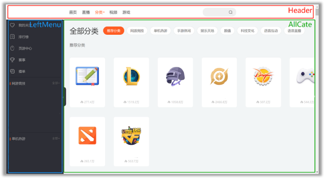<o:p>&nbsp;</o:p>

    
<b>第</b><b>2</b><b>章：</b><b>React</b><b>面向组件编程</b><b><o:p></o:p></b>

    <h2><b>2.1. </b><b>基本理解和使用</b><b><o:p></o:p></b></h2>
    <h3><b>2.1</b><b>.1. </b><b>使用</b><b>React</b><b>开发者工具调试</b><b><o:p></o:p></b></h3>
    
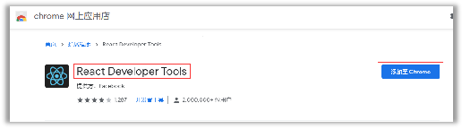<o:p>&nbsp;</o:p>

    <h3><b>2.1.2. </b><b>效果</b><b><o:p></o:p></b></h3>
    
函数式组件：<o:p></o:p>

    
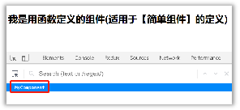<o:p>&nbsp;</o:p>

    
类式组件：<o:p></o:p>

    
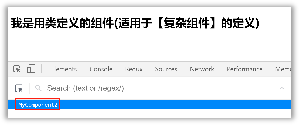<o:p>&nbsp;</o:p>

    <h3><b>2.1.3. </b><b>注意</b><b><o:p></o:p></b></h3>
    
<![if !supportLists]>1.&nbsp;<![endif]>组件名必须首字母大写<o:p></o:p>

    
<![if !supportLists]>2.&nbsp;<![endif]>虚拟DOM元素只能有一个根元素<o:p></o:p>

    
<![if !supportLists]>3.&nbsp;<![endif]>虚拟DOM元素必须有结束标签<o:p></o:p>

    <h3><b>2.1.4. </b><b>渲染类组件标签的基本流程</b><b><o:p></o:p></b></h3>
    
<![if !supportLists]>1.&nbsp;<![endif]>React内部会创建组件实例对象<o:p></o:p>

    
<![if !supportLists]>2.&nbsp;<![endif]>调用render()得到虚拟DOM, 并解析为真实DOM<o:p></o:p>

    
<![if !supportLists]>3.&nbsp;<![endif]>插入到指定的页面元素内部<o:p></o:p>

    <h2><b>2.2. </b><b>组件三大核心属性</b><b>1: state</b><b><o:p></o:p></b></h2>
    <h3><b>2.2.1. </b><b>效果</b><b><o:p></o:p></b></h3>
    
<i>需求</i><i>: </i><i>定义一个展示天气信息的组件</i><i><o:p></o:p></i>

    
<![if !supportLists]>1.&nbsp;<![endif]><i>默认展示天气炎热 或 凉爽</i><i><o:p></o:p></i>

    
<![if !supportLists]>2.&nbsp;<![endif]><i>点击文字切换天气</i><i><o:p></o:p></i>

    
<o:p></o:p>

    <h3><b>2.2.2. </b><b>理解</b><b><o:p></o:p></b></h3>
    
<![if !supportLists]>1.&nbsp;<![endif]>state是组件对象最重要的属性, 值是对象(可以包含多个key-value的组合)<o:p></o:p>

    
<![if !supportLists]>2.&nbsp;<![endif]>组件被称为"状态机", 通过更新组件的state来更新对应的页面显示(重新渲染组件)<o:p></o:p>

    <h3><b>2.2.3. </b><b>强烈注意</b><b><o:p></o:p></b></h3>
    
<![if !supportLists]>1.&nbsp;<![endif]>组件中render方法中的this为组件实例对象<o:p></o:p>

    
<![if !supportLists]>2.&nbsp;<![endif]>组件自定义的方法中this为undefined，如何解决？<o:p></o:p>

    
<![if !supportLists]>a)&nbsp;<![endif]>强制绑定this: 通过函数对象的bind()<o:p></o:p>

    
<![if !supportLists]>b)&nbsp;<![endif]>箭头函数<o:p></o:p>

    
<![if !supportLists]>3.&nbsp;<![endif]>状态数据，不能直接修改或更新<o:p></o:p>

    <h2><b>2.3. </b><b>组件三大核心属性</b><b>2: props</b><b><o:p></o:p></b></h2>
    <h3><b>2.3.1. </b><b>效果</b><b><o:p></o:p></b></h3>
    
<i>需求</i><i>: </i><i>自定义用来显示一个人员信息的组件</i><i><o:p></o:p></i>

    
<![if !supportLists]>1.&nbsp;<![endif]><i>姓名必须指定，且为字符串类型；</i><i><o:p></o:p></i>

    
<![if !supportLists]>2.&nbsp;<![endif]><i>性别为字符串类型，如果性别没有指定，默认为男</i><i><o:p></o:p></i>

    
<![if !supportLists]>3.&nbsp;<![endif]><i>年龄为字符串类型，且为数字类型，默认值为1</i><i>8</i><i><o:p></o:p></i>

    
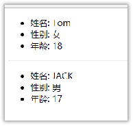<o:p>&nbsp;</o:p>

    <h3><b>2.3.2. </b><b>理解</b><b><o:p></o:p></b></h3>
    
<![if !supportLists]>1.&nbsp;<![endif]>每个组件对象都会有props(properties的简写)属性<o:p></o:p>

    
<![if !supportLists]>2.&nbsp;<![endif]>组件标签的所有属性都保存在props中<o:p></o:p>

    <h3><b>2.3.3. </b><b>作用</b><b><o:p></o:p></b></h3>
    
<![if !supportLists]>1.&nbsp;<![endif]>通过标签属性从组件外向组件内传递变化的数据<o:p></o:p>

    
<![if !supportLists]>2.&nbsp;<![endif]>注意: 组件内部不要修改props数据<o:p></o:p>

    <h3><b>2.3.4. </b><b>编码操作</b><b><o:p></o:p></b></h3>
    
<![if !supportLists]>1.&nbsp;<![endif]>内部读取某个属性值<o:p></o:p>

    
<o:p></o:p>

    
<![if !supportLists]>2.&nbsp;<![endif]>对props中的属性值进行类型限制和必要性限制<o:p></o:p>

    
第一种方式（React v15.5 开始已弃用）：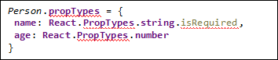<b><o:p></o:p></b>

    
第二种方式（新）：使用prop-types库进限制（需要引入prop-types库）<o:p></o:p>

    
&#9;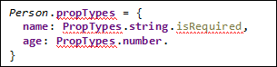<o:p></o:p>

    
<![if !supportLists]>3.&nbsp;<![endif]>扩展属性: 将对象的所有属性通过props传递<o:p></o:p>

    
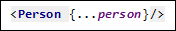<i><o:p></o:p></i>

    
<![if !supportLists]>4.&nbsp;<![endif]>默认属性值：<o:p></o:p>

    
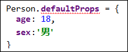<i><o:p></o:p></i>

    
<![if !supportLists]>5.&nbsp;<![endif]>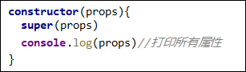组件类的构造函数<o:p></o:p>

    
<i><o:p>&nbsp;</o:p></i>

    
<i><o:p>&nbsp;</o:p></i>

    
<i><o:p>&nbsp;</o:p></i>

    <h2><b>2.4. </b><b>组件三大核心属性</b><b>3: refs</b><b>与事件处理</b><b><o:p></o:p></b></h2>
    <h3><b>2.4.1. </b><b>效果</b><b><o:p></o:p></b></h3>
    
<i>需求: 自定义组件, 功能说明如下:</i><i><o:p></o:p></i>

    
<i>&nbsp;&nbsp;1. 点击按钮, 提示第一个输入框中的值</i><i><o:p></o:p></i>

    
<i>&nbsp;&nbsp;2. 当第2个输入框失去焦点时, 提示这个输入框中的值</i><i><o:p></o:p></i>

    
效果如下：<o:p></o:p>

    
<o:p></o:p>

    <h3><b>2</b><b>.4.2. </b><b>理解</b><b><o:p></o:p></b></h3>
    
组件内的标签可以定义ref属性来标识自己<o:p></o:p>

    <h3><b>2.4.3. </b><b>编码</b><b><o:p></o:p></b></h3>
    
<![if !supportLists]>1.&nbsp;<![endif]>字符串形式的ref<o:p></o:p>

    
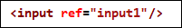<o:p></o:p>

    
<![if !supportLists]>2.&nbsp;<![endif]>回调形式的ref<o:p></o:p>

    
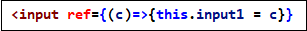<o:p></o:p>

    
<![if !supportLists]>3.&nbsp;<![endif]>createRef创建ref容器&#183;<o:p></o:p>

    
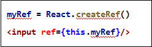<o:p></o:p>

    <h3><b>2.4.4. </b><b>事件处理</b><b><o:p></o:p></b></h3>
    
<![if !supportLists]>1.&nbsp;<![endif]>通过onXxx属性指定事件处理函数(注意大小写)<o:p></o:p>

    
<![if !supportLists]>1)&nbsp;<![endif]>React使用的是自定义(合成)事件, 而不是使用的原生DOM事件<o:p></o:p>

    
<![if !supportLists]>2)&nbsp;<![endif]>React中的事件是通过事件委托方式处理的(委托给组件最外层的元素)<o:p></o:p>

    
<![if !supportLists]>2.&nbsp;<![endif]>通过event.target得到发生事件的DOM元素对象<o:p></o:p>

    <h2><b>2.5. </b><b>收集表单数据</b><b><o:p></o:p></b></h2>
    <h3><b>2.5.1. </b><b>效果</b><b><o:p></o:p></b></h3>
    
<i>需求</i><i>: </i><i>定义一个包含表单的组件</i><i><o:p></o:p></i>

    
<i>&nbsp;&nbsp;</i><i>输入用户名密码后</i><i>, </i><i>点击登录提示输入信息</i><i><o:p></o:p></i>

    
&nbsp;<o:p></o:p>

    <h3><b>2.5.2. </b><b>理解</b><b><o:p></o:p></b></h3>
    
包含表单的组件分类<o:p></o:p>

    
<![if !supportLists]>1.&nbsp;<![endif]>受控组件<o:p></o:p>

    
<![if !supportLists]>2.&nbsp;<![endif]>非受控组件<o:p></o:p>

    <h2><b>2.6. </b><b>组件的生命周期</b><b><o:p></o:p></b></h2>
    <h3><b>2.6.1. </b><b>效果</b><b><o:p></o:p></b></h3>
    
<i>需求</i><i>:</i><i>定义组件实现以下功能：</i><i><o:p></o:p></i>

    
<i>&nbsp;&nbsp;1. </i><i>让指定的文本做显示</i><i>&nbsp;/ </i><i>隐藏的渐变动画</i><i><o:p></o:p></i>

    
<i>&nbsp;&nbsp;2. </i><i>从完全可见，到彻底消失，耗时</i><i>2S</i><i><o:p></o:p></i>

    
<i>&nbsp;&nbsp;3. </i><i>点击&#8220;不活了&#8221;按钮从界面中卸载组件</i><i><o:p></o:p></i>

    
<o:p></o:p>

    <h3><b>2.6.2. </b><b>理解</b><b><o:p></o:p></b></h3>
    
<![if !supportLists]>1.&nbsp;<![endif]>组件从创建到死亡它会经历一些特定的阶段。<o:p></o:p>

    
<![if !supportLists]>2.&nbsp;<![endif]>React组件中包含一系列勾子函数(生命周期回调函数), 会在特定的时刻调用。<o:p></o:p>

    
<![if !supportLists]>3.&nbsp;<![endif]>我们在定义组件时，会在特定的生命周期回调函数中，做特定的工作。<o:p></o:p>

    <h3><b>2.6.3. </b><b>生命周期流程图</b><b>(</b><b>旧</b><b>)</b><b><o:p></o:p></b></h3>
    
<o:p>&nbsp;</o:p>

    
生命周期的三个阶段（旧）<o:p></o:p>

    
<b>&#9;</b><b>1. </b><b>初始化阶段</b><b>:</b>&nbsp;由ReactDOM.render()触发---初次渲染<o:p></o:p>

    
<![if !supportLists]>1.&nbsp;<![endif]>constructor()<o:p></o:p>

    
<![if !supportLists]>2.&nbsp;<![endif]>componentWillMount()<o:p></o:p>

    
<![if !supportLists]>3.&nbsp;<![endif]>render()<o:p></o:p>

    
<![if !supportLists]>4.&nbsp;<![endif]>componentDidMount()<o:p></o:p>

    
<b>&#9;</b><b>2. </b><b>更新阶段</b><b>: </b>由组件内部this.setSate()或父组件重新render触发<b><o:p></o:p></b>

    
<![if !supportLists]>1.&nbsp;<![endif]>shouldComponentUpdate()<o:p></o:p>

    
<![if !supportLists]>2.&nbsp;<![endif]>componentWillUpdate()<o:p></o:p>

    
<![if !supportLists]>3.&nbsp;<![endif]>render()<o:p></o:p>

    
<![if !supportLists]>4.&nbsp;<![endif]>componentDidUpdate()<o:p></o:p>

    
&#9;<b>3. </b><b>卸载组件</b><b>: </b>由ReactDOM.unmountComponentAtNode()触发<o:p></o:p>

    
<![if !supportLists]>1.&nbsp;<![endif]>componentWillUnmount()<o:p></o:p>

    <h3><b>2.6.4. </b><b>生命周期流程图</b><b>(</b><b>新</b><b>)</b><b><o:p></o:p></b></h3>
    
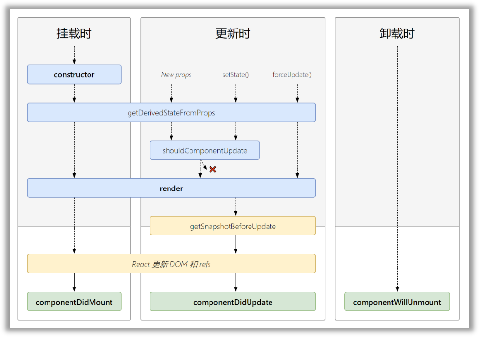<o:p>&nbsp;</o:p>

    
生命周期的三个阶段（新）<o:p></o:p>

    
<b>1. </b><b>初始化阶段</b><b>:</b>&nbsp;由ReactDOM.render()触发---初次渲染<o:p></o:p>

    
<![if !supportLists]>1.&nbsp;<![endif]>constructor()<o:p></o:p>

    
<![if !supportLists]>2.&nbsp;<![endif]><b>getDerivedStateFromProps </b><b><o:p></o:p></b>

    
<![if !supportLists]>3.&nbsp;<![endif]>render()<o:p></o:p>

    
<![if !supportLists]>4.&nbsp;<![endif]>componentDidMount()<o:p></o:p>

    
<b>&#9;</b><b>2. </b><b>更新阶段</b><b>: </b>由组件内部this.setSate()或父组件重新render触发<b><o:p></o:p></b>

    
<![if !supportLists]>1.&nbsp;<![endif]><b>getDerivedStateFromProps</b><b><o:p></o:p></b>

    
<![if !supportLists]>2.&nbsp;<![endif]>shouldComponentUpdate()<o:p></o:p>

    
<![if !supportLists]>3.&nbsp;<![endif]>render()<o:p></o:p>

    
<![if !supportLists]>4.&nbsp;<![endif]><b>getSnapshotBeforeUpdate</b><b><o:p></o:p></b>

    
<![if !supportLists]>5.&nbsp;<![endif]>componentDidUpdate()<o:p></o:p>

    
&#9;<b>3. </b><b>卸载组件</b><b>: </b>由ReactDOM.unmountComponentAtNode()触发<o:p></o:p>

    
<![if !supportLists]>1.&nbsp;<![endif]>componentWillUnmount()<o:p></o:p>

    <h3><b>2.6.5. </b><b>重要的勾子</b><b><o:p></o:p></b></h3>
    
<![if !supportLists]>1.&nbsp;<![endif]>render：初始化渲染或更新渲染调用<o:p></o:p>

    
<![if !supportLists]>2.&nbsp;<![endif]>componentDidMount：开启监听, 发送ajax请求<o:p></o:p>

    
<![if !supportLists]>3.&nbsp;<![endif]>componentWillUnmount：做一些收尾工作, 如: 清理定时器<o:p></o:p>

    <h3><b>2.6.6. </b><b>即将废弃的勾子</b><b><o:p></o:p></b></h3>
    
<![if !supportLists]>1.&nbsp;<![endif]>componentWillMount<o:p></o:p>

    
<![if !supportLists]>2.&nbsp;<![endif]>componentWillReceiveProps<o:p></o:p>

    
<![if !supportLists]>3.&nbsp;<![endif]>componentWillUpdate<o:p></o:p>

    
现在使用会出现警告，下一个大版本需要加上UNSAFE_前缀才能使用，以后可能会被彻底废弃，不建议使用。<o:p></o:p>

    <h2><b>2.7. </b><b>虚拟</b><b>DOM</b><b>与</b><b>DOM Di</b><b>ffing</b><b>算法</b><b><o:p></o:p></b></h2>
    <h3><b>2.7.1. </b><b>效果</b><b><o:p></o:p></b></h3>
    
<i>需求：验证虚拟DOM Diffing算法的存在</i><i><o:p></o:p></i>

    
<o:p></o:p>

    <h3><b>2.7.2. </b><b>基本原理图</b><b><o:p></o:p></b></h3>
    
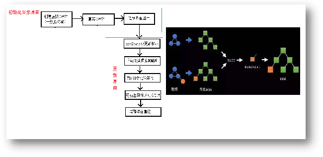<o:p>&nbsp;</o:p>

    
<b>第</b><b>3</b><b>章：R</b><b>eact</b><b>应用</b><b>(</b><b>基于R</b><b>eact</b><b>脚手架</b><b>)</b><b><o:p></o:p></b>

    <h2><b>3.1. </b><b>使用</b><b>create-react-app</b><b>创建</b><b>react</b><b>应用</b><b><o:p></o:p></b></h2>
    <h3><b>3.1.1. react</b><b>脚手架</b><b><o:p></o:p></b></h3>
    
<![if !supportLists]>1.&nbsp;<![endif]>xxx脚手架: 用来帮助程序员快速创建一个基于xxx库的模板项目<o:p></o:p>

    
<![if !supportLists]>1.&nbsp;<![endif]>包含了所有需要的配置（语法检查、jsx编译、devServer&#8230;）<o:p></o:p>

    
<![if !supportLists]>2.&nbsp;<![endif]>下载好了所有相关的依赖<o:p></o:p>

    
<![if !supportLists]>3.&nbsp;<![endif]>可以直接运行一个简单效果<o:p></o:p>

    
<![if !supportLists]>2.&nbsp;<![endif]>react提供了一个用于创建react项目的脚手架库: create-react-app<o:p></o:p>

    
<![if !supportLists]>3.&nbsp;<![endif]>项目的整体技术架构为: &nbsp;react + webpack + es6 + eslint<o:p></o:p>

    
<![if !supportLists]>4.&nbsp;<![endif]>使用脚手架开发的项目的特点: 模块化, 组件化, 工程化<o:p></o:p>

    <h3><b>3.1.2. </b><b>创建项目并启动</b><b><o:p></o:p></b></h3>
    
<b>第一步</b>，全局安装：npm i -g create-react-app<o:p></o:p>

    
<b>第二步</b>，切换到想创项目的目录，使用命令：create-react-app hello-react<o:p></o:p>

    
<b>第三步</b>，进入项目文件夹：cd hello-react<o:p></o:p>

    
<b>第四步</b>，启动项目：npm start<o:p></o:p>

    <h3><b>3.1.3. react</b><b>脚手架项目结构</b><b><o:p></o:p></b></h3>
    
&#9;public&nbsp;---- 静态资源文件夹<o:p></o:p>

    
&#9;&#9;favicon.icon&nbsp;------ 网站页签图标<o:p></o:p>

    
&#9;&#9;<b>index.html</b><b>&nbsp;-------- </b><b>主页面</b><b><o:p></o:p></b>

    
&#9;&#9;logo192.png&nbsp;------- logo图<o:p></o:p>

    
&#9;&#9;logo512.png&nbsp;------- logo图<o:p></o:p>

    
&#9;&#9;manifest.json&nbsp;----- 应用加壳的配置文件<o:p></o:p>

    
&#9;&#9;robots.txt&nbsp;-------- 爬虫协议文件<o:p></o:p>

    
src&nbsp;---- 源码文件夹<o:p></o:p>

    
&#9;&#9;App.css&nbsp;-------- App组件的样式<o:p></o:p>

    
&#9;&#9;<b>App.js </b><b>--------- </b><b>App组件</b><b><o:p></o:p></b>

    
&#9;&#9;App.test.js&nbsp;---- 用于给App做测试<o:p></o:p>

    
&#9;&#9;index.css ------ 样式<o:p></o:p>

    
&#9;&#9;<b>index.js</b><b>&nbsp;</b><b>-</b><b>------ </b><b>入口文件</b><b><o:p></o:p></b>

    
&#9;&#9;logo.svg ------- logo图<o:p></o:p>

    
&#9;&#9;reportWebVitals.js<o:p></o:p>

    
&#9;&#9;&#9;--- 页面性能分析文件(需要web-vitals库的支持)<o:p></o:p>

    
&#9;&#9;setupTests.js<o:p></o:p>

    
&#9;&#9;&#9;---- 组件单元测试的文件(需要jest-dom库的支持)<o:p></o:p>

    <h3><b>3.1.4. </b><b>功能界面的组件化编码流程（通用）</b><b><o:p></o:p></b></h3>
    
1. 拆分组件: 拆分界面,抽取组件<o:p></o:p>

    
2. 实现静态组件: 使用组件实现静态页面效果<o:p></o:p>

    
3. 实现动态组件<o:p></o:p>

    
3.1 动态显示初始化数据<o:p></o:p>

    
3.1.1 数据类型<o:p></o:p>

    
3.1.2 数据名称<o:p></o:p>

    
3.1.2 保存在哪个组件?<o:p></o:p>

    
3.2 交互(从绑定事件监听开始)<o:p></o:p>

    <h2><b>3.2. </b><b>组件的组合使用</b><b>-TodoList </b><b><o:p></o:p></b></h2>
    
<i>功能</i><i>: </i><i>组件化实现此功能</i><i><o:p></o:p></i>

    
<i>&nbsp;&nbsp;1. </i><i>显示所有</i><i>todo</i><i>列表</i><i><o:p></o:p></i>

    
<i>&nbsp;&nbsp;2. </i><i>输入文本</i><i>, </i><i>点击按钮显示到列表的首位</i><i>, </i><i>并清除输入的文本</i><i><o:p></o:p></i>

    
<o:p></o:p>

    
<b>第</b><b>4</b><b>章：R</b><b>eact ajax</b><b><o:p></o:p></b>

    <h2><b>4.1. </b><b>理解</b><b><o:p></o:p></b></h2>
    <h3><b>4.1.1. </b><b>前置说明</b><b><o:p></o:p></b></h3>
    
<![if !supportLists]>1.&nbsp;<![endif]>React本身只关注于界面, 并不包含发送ajax请求的代码<o:p></o:p>

    
<![if !supportLists]>2.&nbsp;<![endif]>前端应用需要通过ajax请求与后台进行交互(json数据)<o:p></o:p>

    
<![if !supportLists]>3.&nbsp;<![endif]>react应用中需要集成第三方ajax库(或自己封装)<o:p></o:p>

    <h3><b>4.1.2. </b><b>常用的</b><b>ajax</b><b>请求库</b><b><o:p></o:p></b></h3>
    
<![if !supportLists]>1.&nbsp;<![endif]>jQuery: 比较重, 如果需要另外引入不建议使用<o:p></o:p>

    
<![if !supportLists]>2.&nbsp;<![endif]>axios: 轻量级, 建议使用<o:p></o:p>

    
<![if !supportLists]>1)&nbsp;<![endif]>封装XmlHttpRequest对象的ajax<o:p></o:p>

    
<![if !supportLists]>2)&nbsp;<![endif]>&nbsp;promise风格<o:p></o:p>

    
<![if !supportLists]>3)&nbsp;<![endif]>可以用在浏览器端和node服务器端<o:p></o:p>

    <h2><b>4.2. axios</b><b><o:p></o:p></b></h2>
    <h3><b>4.2.1. </b><b>文档</b><b><o:p></o:p></b></h3>
    
<a href="https://github.com/axios/axios"><u>https://github.com/axios/axios</u></a><u><o:p></o:p></u>

    <h3><b>4.2.2. </b><b>相关</b><b>API</b><b><o:p></o:p></b></h3>
    
<![if !supportLists]>1)&nbsp;<![endif]>GET请求<o:p></o:p>

    <table class=MsoTableGrid border=1 cellspacing=0 style="border-collapse:collapse;width:426.0000pt;mso-table-layout-alt:fixed;
border:none;mso-border-left-alt:0.5000pt solid windowtext;mso-border-top-alt:0.5000pt solid windowtext;
mso-border-right-alt:0.5000pt solid windowtext;mso-border-bottom-alt:0.5000pt solid windowtext;mso-border-insideh:0.5000pt solid windowtext;
mso-border-insidev:0.5000pt solid windowtext;mso-padding-alt:0.0000pt 5.4000pt 0.0000pt 5.4000pt ;">
        <tr>
            <td width=568 valign=top style="width:426.0000pt;padding:0.0000pt 5.4000pt 0.0000pt 5.4000pt ;border-left:1.0000pt solid windowtext;
mso-border-left-alt:0.5000pt solid windowtext;border-right:1.0000pt solid windowtext;mso-border-right-alt:0.5000pt solid windowtext;
border-top:1.0000pt solid windowtext;mso-border-top-alt:0.5000pt solid windowtext;border-bottom:1.0000pt solid windowtext;
mso-border-bottom-alt:0.5000pt solid windowtext;">
                
axios.get('/user?ID=12345')<o:p></o:p>

                
&#160;&#160;.then(function&#160;(response)&#160;{<o:p></o:p>

                
&#160;&#160;&#160;&#160;console.log(response.data);<o:p></o:p>

                
&#160;&#160;})<o:p></o:p>

                
&#160;&#160;.catch(function&#160;(error)&#160;{<o:p></o:p>

                
&#160;&#160;&#160;&#160;console.log(error);<o:p></o:p>

                
&#160;&#160;});<o:p></o:p>

                
<o:p>&nbsp;</o:p>

                
axios.get('/user',&#160;{<o:p></o:p>

                
&#160;&#160;&#160;&#160;params:&#160;{<o:p></o:p>

                
&#160;&#160;&#160;&#160;&#160;&#160;ID:&#160;12345<o:p></o:p>

                
&#160;&#160;&#160;&#160;}<o:p></o:p>

                
&#160;&#160;})<o:p></o:p>

                
&#160;&#160;.then(function&#160;(response)&#160;{<o:p></o:p>

                
&#160;&#160;&#160;&#160;console.log(response);<o:p></o:p>

                
&#160;&#160;})<o:p></o:p>

                
&#160;&#160;.catch(function&#160;(error)&#160;{<o:p></o:p>

                
&#160;&#160;&#160;&#160;console.log(error);<o:p></o:p>

                
&#160;&#160;});<b><o:p></o:p></b>

            </td>
        </tr>
    </table>
    
<o:p>&nbsp;</o:p>

    
<![if !supportLists]>2)&nbsp;<![endif]>POST请求<o:p></o:p>

    <table class=MsoTableGrid border=1 cellspacing=0 style="border-collapse:collapse;width:426.0000pt;mso-table-layout-alt:fixed;
border:none;mso-border-left-alt:0.5000pt solid windowtext;mso-border-top-alt:0.5000pt solid windowtext;
mso-border-right-alt:0.5000pt solid windowtext;mso-border-bottom-alt:0.5000pt solid windowtext;mso-border-insideh:0.5000pt solid windowtext;
mso-border-insidev:0.5000pt solid windowtext;mso-padding-alt:0.0000pt 5.4000pt 0.0000pt 5.4000pt ;">
        <tr style="height:129.3500pt;">
            <td width=568 valign=top style="width:426.0000pt;padding:0.0000pt 5.4000pt 0.0000pt 5.4000pt ;border-left:1.0000pt solid windowtext;
mso-border-left-alt:0.5000pt solid windowtext;border-right:1.0000pt solid windowtext;mso-border-right-alt:0.5000pt solid windowtext;
border-top:1.0000pt solid windowtext;mso-border-top-alt:0.5000pt solid windowtext;border-bottom:1.0000pt solid windowtext;
mso-border-bottom-alt:0.5000pt solid windowtext;">
                
axios.post('/user',&#160;{<o:p></o:p>

                
&#160;&#160;firstName:&#160;'Fred',<o:p></o:p>

                
&#160;&#160;lastName:&#160;'Flintstone'<o:p></o:p>

                
})<o:p></o:p>

                
.then(function&#160;(response)&#160;{<o:p></o:p>

                
console.log(response);<o:p></o:p>

                
})<o:p></o:p>

                
.catch(function&#160;(error)&#160;{<o:p></o:p>

                
console.log(error);<o:p></o:p>

                
});<b><o:p></o:p></b>

            </td>
        </tr>
    </table>
    <h2><b>4.3. </b><b>案例&#8212;</b><b>github</b><b>用户搜索</b><b><o:p></o:p></b></h2>
    <h3><b>4.3.1. </b><b>效果</b><b><o:p></o:p></b></h3>
    
<o:p></o:p>

    
请求地址: <a href="https://api.github.com/search/users?q=xxxxxx"><u>https://api.github.com/search/users?q=xxxxxx</u></a><o:p></o:p>

    <h2><b>4.</b><b>4</b><b>. 消息订阅-发布机制</b><b><o:p></o:p></b></h2>
    
<![if !supportLists]>1.&nbsp;<![endif]>工具库: PubSubJS<o:p></o:p>

    
<![if !supportLists]>2.&nbsp;<![endif]>下载: npm install pubsub-js --save<o:p></o:p>

    
<![if !supportLists]>3.&nbsp;<![endif]>使用: <o:p></o:p>

    
<![if !supportLists]>1)&nbsp;<![endif]>import PubSub from 'pubsub-js' //引入<o:p></o:p>

    
<![if !supportLists]>2)&nbsp;<![endif]>PubSub.subscribe('delete', function(data){ }); //订阅<o:p></o:p>

    
<![if !supportLists]>3)&nbsp;<![endif]>PubSub.publish('delete', data) //发布消息<o:p></o:p>

    <h2><b>4.</b><b>5</b><b>. 扩展：Fetch</b><b><o:p></o:p></b></h2>
    <h3><b>4.</b><b>5</b><b>.1. 文档</b><b><o:p></o:p></b></h3>
    
<![if !supportLists]>1.&nbsp;<![endif]><a
            href="https://github.github.io/fetch/"><u>https://github.github.io/fetch/</u></a><u><o:p></o:p></u>

    
<![if !supportLists]>2.&nbsp;<![endif]><a
            href="https://segmentfault.com/a/1190000003810652"><u>https://segmentfault.com/a/1190000003810652</u></a><u><o:p></o:p></u>

    <h3><b>4.</b><b>5</b><b>.</b><b>2</b><b>. 特点</b><b><o:p></o:p></b></h3>
    
<![if !supportLists]>1.&nbsp;<![endif]>fetch: 原生函数，不再使用XmlHttpRequest对象提交ajax请求<o:p></o:p>

    
<![if !supportLists]>2.&nbsp;<![endif]>老版本浏览器可能不支持<o:p></o:p>

    <h3><b>4.</b><b>5</b><b>.</b><b>3</b><b>. 相关API</b><b><o:p></o:p></b></h3>
    
<![if !supportLists]>1)&nbsp;<![endif]>GET请求<o:p></o:p>

    <table class=MsoTableGrid border=1 cellspacing=0 style="border-collapse:collapse;width:426.1000pt;mso-table-layout-alt:fixed;
border:none;mso-border-left-alt:0.5000pt solid windowtext;mso-border-top-alt:0.5000pt solid windowtext;
mso-border-right-alt:0.5000pt solid windowtext;mso-border-bottom-alt:0.5000pt solid windowtext;mso-border-insideh:0.5000pt solid windowtext;
mso-border-insidev:0.5000pt solid windowtext;mso-padding-alt:0.0000pt 5.4000pt 0.0000pt 5.4000pt ;">
        <tr>
            <td width=568 valign=top style="width:426.1000pt;padding:0.0000pt 5.4000pt 0.0000pt 5.4000pt ;border-left:1.0000pt solid windowtext;
mso-border-left-alt:0.5000pt solid windowtext;border-right:1.0000pt solid windowtext;mso-border-right-alt:0.5000pt solid windowtext;
border-top:1.0000pt solid windowtext;mso-border-top-alt:0.5000pt solid windowtext;border-bottom:1.0000pt solid windowtext;
mso-border-bottom-alt:0.5000pt solid windowtext;">
                
fetch(url).then(function(response)&#160;{<o:p></o:p>

                
&#160;&#160;&#160;&#160;return&#160;response.json()<o:p></o:p>

                
&#160;&#160;}).then(function(data)&#160;{<o:p></o:p>

                
&#160;&#160;&#160;&#160;console.log(data)<o:p></o:p>

                
&#160;&#160;}).catch(function(e)&#160;{<o:p></o:p>

                
&#160;&#160;&#160;&#160;console.log(e)<o:p></o:p>

                
&#160;&#160;});<o:p></o:p>

            </td>
        </tr>
    </table>
    
<o:p>&nbsp;</o:p>

    
<![if !supportLists]>2)&nbsp;<![endif]>POST请求<o:p></o:p>

    <table class=MsoTableGrid border=1 cellspacing=0 style="border-collapse:collapse;width:426.1000pt;mso-table-layout-alt:fixed;
border:none;mso-border-left-alt:0.5000pt solid windowtext;mso-border-top-alt:0.5000pt solid windowtext;
mso-border-right-alt:0.5000pt solid windowtext;mso-border-bottom-alt:0.5000pt solid windowtext;mso-border-insideh:0.5000pt solid windowtext;
mso-border-insidev:0.5000pt solid windowtext;mso-padding-alt:0.0000pt 5.4000pt 0.0000pt 5.4000pt ;">
        <tr>
            <td width=568 valign=top style="width:426.1000pt;padding:0.0000pt 5.4000pt 0.0000pt 5.4000pt ;border-left:1.0000pt solid windowtext;
mso-border-left-alt:0.5000pt solid windowtext;border-right:1.0000pt solid windowtext;mso-border-right-alt:0.5000pt solid windowtext;
border-top:1.0000pt solid windowtext;mso-border-top-alt:0.5000pt solid windowtext;border-bottom:1.0000pt solid windowtext;
mso-border-bottom-alt:0.5000pt solid windowtext;">
                
&#160;&#160;fetch(url,&#160;{<o:p></o:p>

                
&#160;&#160;&#160;&#160;method:&#160;"POST",<o:p></o:p>

                
&#160;&#160;&#160;&#160;body:&#160;JSON.stringify(data),<o:p></o:p>

                
&#160;&#160;}).then(function(data)&#160;{<o:p></o:p>

                
&#160;&#160;&#160;&#160;console.log(data)<o:p></o:p>

                
&#160;&#160;}).catch(function(e)&#160;{<o:p></o:p>

                
&#160;&#160;&#160;&#160;console.log(e)<o:p></o:p>

                
&#160;&#160;})<o:p></o:p>

            </td>
        </tr>
    </table>
    
<o:p>&nbsp;</o:p>

    
<b>第</b><b>5</b><b>章：React路由</b><b><o:p></o:p></b>

    <h2><b>5.1. </b><b>相关理解</b><b><o:p></o:p></b></h2>
    <h3><b>5.1.1. SPA</b><b>的理解</b><b><o:p></o:p></b></h3>
    
<![if !supportLists]>1.&nbsp;<![endif]>单页Web应用（single page web application，SPA）。<o:p></o:p>

    
<![if !supportLists]>2.&nbsp;<![endif]>整个应用只有<b>一个完整的页面</b>。<o:p></o:p>

    
<![if !supportLists]>3.&nbsp;<![endif]>点击页面中的链接<b>不会刷新</b>页面，只会做页面的<b>局部更新。</b><o:p></o:p>

    
<![if !supportLists]>4.&nbsp;<![endif]>数据都需要通过ajax请求获取, 并在前端异步展现。<o:p></o:p>

    <h3><b>5.1.2. </b><b>路由的理解</b><b><o:p></o:p></b></h3>
    
<![if !supportLists]>1.&nbsp;<![endif]><b>什么是路由</b><b>?</b><b><o:p></o:p></b>

    
<![if !supportLists]>1.&nbsp;<![endif]>一个路由就是一个映射关系(key:value)<o:p></o:p>

    
<![if !supportLists]>2.&nbsp;<![endif]>key为路径, value可能是function或component<o:p></o:p>

    
<![if !supportLists]>2.&nbsp;<![endif]><b>路由分类</b><b><o:p></o:p></b>

    
<![if !supportLists]>1.&nbsp;<![endif]>后端路由：<o:p></o:p>

    
<![if !supportLists]>1)&nbsp;<![endif]>理解：&nbsp;value是function, 用来处理客户端提交的请求。<o:p></o:p>

    
<![if !supportLists]>2)&nbsp;<![endif]>注册路由： router.get(path, function(req, res))<o:p></o:p>

    
<![if !supportLists]>3)&nbsp;<![endif]>工作过程：当node接收到一个请求时, 根据请求路径找到匹配的路由, 调用路由中的函数来处理请求, 返回响应数据<o:p></o:p>

    
<![if !supportLists]>2.&nbsp;<![endif]>前端路由：<o:p></o:p>

    
<![if !supportLists]>1)&nbsp;<![endif]>浏览器端路由，value是component，用于展示页面内容。<o:p></o:p>

    
<![if !supportLists]>2)&nbsp;<![endif]>注册路由: &#60;Route path="/test" component={Test}&#62;<o:p></o:p>

    
<![if !supportLists]>3)&nbsp;<![endif]>工作过程：当浏览器的path变为/test时, 当前路由组件就会变为Test组件<o:p></o:p>

    <h3><b>5.1.3. react-router</b><b>-dom的理解</b><b><o:p></o:p></b></h3>
    
<![if !supportLists]>1.&nbsp;<![endif]>react的一个插件库。<o:p></o:p>

    
<![if !supportLists]>2.&nbsp;<![endif]>专门用来实现一个SPA应用。<o:p></o:p>

    
<![if !supportLists]>3.&nbsp;<![endif]>基于react的项目基本都会用到此库。<o:p></o:p>

    <h2><b>5.2. react-router-dom</b><b>相关</b><b>API</b><b><o:p></o:p></b></h2>
    <h3 style="text-indent:14.0000pt;mso-char-indent-count:1.0000;"><b>5.2.1. </b><b>内置组件</b><b><o:p></o:p></b></h3>
    
<![if !supportLists]>1.&nbsp;<![endif]>&#60;BrowserRouter&#62;<o:p></o:p>

    
<![if !supportLists]>2.&nbsp;<![endif]>&#60;HashRouter&#62;<o:p></o:p>

    
<![if !supportLists]>3.&nbsp;<![endif]>&#60;Route&#62;<o:p></o:p>

    
<![if !supportLists]>4.&nbsp;<![endif]>&#60;Redirect&#62;<o:p></o:p>

    
<![if !supportLists]>5.&nbsp;<![endif]>&#60;Link&#62;<o:p></o:p>

    
<![if !supportLists]>6.&nbsp;<![endif]>&#60;NavLink&#62;<o:p></o:p>

    
<![if !supportLists]>7.&nbsp;<![endif]>&#60;Switch&#62;<o:p></o:p>

    <h3 style="text-indent:21.2500pt;"><b>5.2.2. </b><b>其它</b><b><o:p></o:p></b></h3>
    
<![if !supportLists]>1.&nbsp;<![endif]>history对象<o:p></o:p>

    
<![if !supportLists]>2.&nbsp;<![endif]>match对象<o:p></o:p>

    
<![if !supportLists]>3.&nbsp;<![endif]>withRouter函数<o:p></o:p>

    <h2><b>5.3. </b><b>基本路由使用</b><b><o:p></o:p></b></h2>
    <h3><b>5.3.1. </b><b>效果</b><b><o:p></o:p></b></h3>
    
<o:p></o:p>

    <h3><b>5.3.2. </b><b>准备</b><b><o:p></o:p></b></h3>
    
<![if !supportLists]>1.&nbsp;<![endif]>下载react-router-dom: npm install --save react-router-dom<o:p></o:p>

    
<![if !supportLists]>2.&nbsp;<![endif]>引入bootstrap.css: &#60;link rel="stylesheet" href="/css/bootstrap.css"&#62;<o:p></o:p>

    <h2><b>5.4. </b><b>嵌套路由使用</b><b><o:p></o:p></b></h2>
    <h3 style="text-indent:21.0000pt;"><b>效果</b><b><o:p></o:p></b></h3>
    
<o:p></o:p>

    <h2><b>5.5. </b><b>向路由组件传递参数数据</b><b><o:p></o:p></b></h2>
    <h3 style="text-indent:21.0000pt;"><b>效果</b><b><o:p></o:p></b></h3>
    
<o:p></o:p>

    <h2><b>5.6. </b><b>多种路由跳转方式</b><b><o:p></o:p></b></h2>
    <h3 style="text-indent:21.0000pt;"><b>效果</b><b><o:p></o:p></b></h3>
    
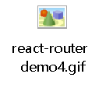<o:p></o:p>

    
<b>第</b><b>6</b><b>章：R</b><b>eact UI</b><b>组件库</b><b><o:p></o:p></b>

    <h2><b>6.1.</b><b>流行的开源</b><b>React UI</b><b>组件库</b><b><o:p></o:p></b></h2>
    <h3 style="margin-left:22.0000pt;mso-para-margin-left:2.0000gd;"><b>6.1.1. material-ui(</b><b>国外</b><b>)</b><b><o:p></o:p></b></h3>
    
<![if !supportLists]>1.&nbsp;<![endif]>官网: <a href="#/"><u>http://www.material-ui.com/#/</u></a><o:p></o:p>

    
<![if !supportLists]>2.&nbsp;<![endif]>github: <a
            href="https://github.com/callemall/material-ui"><u>https://github.com/callemall/material-ui</u></a><o:p></o:p>

    <h3 style="margin-left:22.0000pt;mso-para-margin-left:2.0000gd;"><b>6.1.2. ant-design(</b><b>国内蚂蚁金服</b><b>)</b><b><o:p></o:p></b></h3>
    
<![if !supportLists]>1.&nbsp;<![endif]>官网: <a href="https://ant.design/index-cn"><u>https://ant.design/index-cn</u></a><o:p></o:p>

    
<![if !supportLists]>2.&nbsp;<![endif]>Github: <a
            href="https://github.com/ant-design/ant-design/"><u>https://github.com/ant-design/ant-design/</u></a><o:p></o:p>

    
<b>第</b><b>7</b><b>章：</b><b>redux</b><b><o:p></o:p></b>

    <h2><b>7.1. redux</b><b>理解</b><b><o:p></o:p></b></h2>
    <h3 style="margin-left:22.0000pt;mso-para-margin-left:2.0000gd;"><b>7.1.1. </b><b>学习文档</b><b><o:p></o:p></b></h3>
    
<![if !supportLists]>1.&nbsp;<![endif]>英文文档: <a href="https://redux.js.org/"><u>https://redux.js.org/</u></a><o:p></o:p>

    
<![if !supportLists]>2.&nbsp;<![endif]>中文文档: <a href="http://www.redux.org.cn/"><u>http://www.redux.org.cn/</u></a><o:p></o:p>

    
<![if !supportLists]>3.&nbsp;<![endif]>Github: <a href="https://github.com/reactjs/redux"><u>https://github.com/reactjs/redux</u></a><o:p></o:p>

    <h3 style="margin-left:22.0000pt;mso-para-margin-left:2.0000gd;"><b>7.1.2. redux</b><b>是什么</b><b><o:p></o:p></b></h3>
    
<![if !supportLists]>1.&nbsp;<![endif]>redux是一个专门用于做<b>状态管理</b>的JS库(不是react插件库)。<o:p></o:p>

    
<![if !supportLists]>2.&nbsp;<![endif]>它可以用在react, angular, vue等项目中, 但基本与react配合使用。<o:p></o:p>

    
<![if !supportLists]>3.&nbsp;<![endif]>作用: 集中式管理react应用中多个组件<b>共享</b>的状态。<o:p></o:p>

    <h3 style="margin-left:22.0000pt;mso-para-margin-left:2.0000gd;"><b>7.1.3. </b><b>什么情况下需要使用</b><b>redux</b><b><o:p></o:p></b></h3>
    
<![if !supportLists]>1.&nbsp;<![endif]>某个组件的状态，需要让其他组件可以随时拿到（共享）。<o:p></o:p>

    
<![if !supportLists]>2.&nbsp;<![endif]>一个组件需要改变另一个组件的状态（通信）。<o:p></o:p>

    
<![if !supportLists]>3.&nbsp;<![endif]>总体原则：能不用就不用, 如果不用比较吃力才考虑使用。<o:p></o:p>

    <h3 style="text-indent:22.0000pt;"><b>7.1.4. redux</b><b>工作流程</b><b><o:p></o:p></b></h3>
    
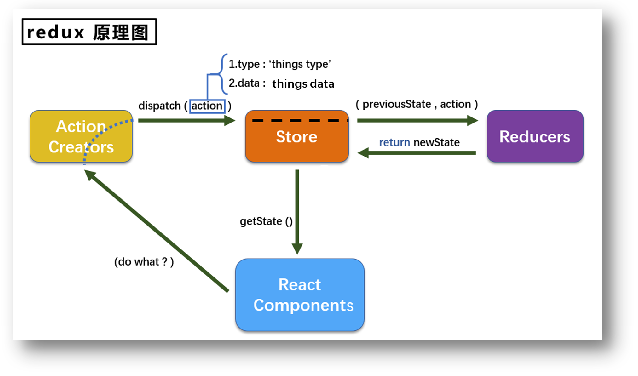<o:p>&nbsp;</o:p>

    <h2><b>7.2. redux</b><b>的三个核心概念</b><b><o:p></o:p></b></h2>
    <h3 style="margin-left:22.0000pt;mso-para-margin-left:2.0000gd;"><b>7.2.1. action</b><b><o:p></o:p></b></h3>
    
<![if !supportLists]>1.&nbsp;<![endif]>动作的对象<o:p></o:p>

    
<![if !supportLists]>2.&nbsp;<![endif]>包含2个属性<o:p></o:p>

    
<![if !supportLists]>&#108;&nbsp;<![endif]>type：标识属性, 值为字符串, 唯一, 必要属性<o:p></o:p>

    
<![if !supportLists]>&#108;&nbsp;<![endif]>data：数据属性, 值类型任意, 可选属性<o:p></o:p>

    
<![if !supportLists]>3.&nbsp;<![endif]>例子：{ type:&#160;'ADD_STUDENT<a name="_Hlk56260014">'</a>,data:{name:&nbsp;'tom',age:18} }<o:p></o:p>

    <h3 style="margin-left:33.0000pt;mso-para-margin-left:3.0000gd;"><b>7.2.2. reducer</b><b><o:p></o:p></b></h3>
    
<![if !supportLists]>1.&nbsp;<![endif]>用于初始化状态、加工状态。<o:p></o:p>

    
<![if !supportLists]>2.&nbsp;<![endif]>加工时，根据旧的state和action，&nbsp;产生新的state的<b>纯函数</b><b>。</b><o:p></o:p>

    <h3 style="margin-left:33.0000pt;mso-para-margin-left:3.0000gd;"><b>7.2.3. store</b><b><o:p></o:p></b></h3>
    
<![if !supportLists]>1.&nbsp;<![endif]>将state、action、reducer联系在一起的对象<o:p></o:p>

    
<![if !supportLists]>2.&nbsp;<![endif]>如何得到此对象?<o:p></o:p>

    
<![if !supportLists]>1)&nbsp;<![endif]>import {createStore} from 'redux'<o:p></o:p>

    
<![if !supportLists]>2)&nbsp;<![endif]>import reducer from './reducers'<o:p></o:p>

    
<![if !supportLists]>3)&nbsp;<![endif]>const store = createStore(reducer)<o:p></o:p>

    
<![if !supportLists]>3.&nbsp;<![endif]>此对象的功能?<o:p></o:p>

    
<![if !supportLists]>1)&nbsp;<![endif]>getState(): 得到state<o:p></o:p>

    
<![if !supportLists]>2)&nbsp;<![endif]>dispatch(action): 分发action, 触发reducer调用, 产生新的state<o:p></o:p>

    
<![if !supportLists]>3)&nbsp;<![endif]>subscribe(listener): 注册监听, 当产生了新的state时, 自动调用<o:p></o:p>

    <h2><b>7.3. redux</b><b>的核心</b><b>API</b><b><o:p></o:p></b></h2>
    <h3 style="margin-left:33.0000pt;mso-para-margin-left:3.0000gd;"><b>7.3</b><b>.</b><b>1. createstore()</b><b><o:p></o:p></b></h3>
    
作用：创建包含指定reducer的store对象<o:p></o:p>

    <h3 style="margin-left:33.0000pt;mso-para-margin-left:3.0000gd;"><b>7.3</b><b>.</b><b>2. </b><b>store对象</b><b><o:p></o:p></b></h3>
    
<![if !supportLists]>1.&nbsp;<![endif]>作用: redux库最核心的管理对象<o:p></o:p>

    
<![if !supportLists]>2.&nbsp;<![endif]>它内部维护着:<o:p></o:p>

    
<![if !supportLists]>1)&nbsp;<![endif]>state<o:p></o:p>

    
<![if !supportLists]>2)&nbsp;<![endif]>reducer<o:p></o:p>

    
<![if !supportLists]>3.&nbsp;<![endif]>核心方法:<o:p></o:p>

    
<![if !supportLists]>1)&nbsp;<![endif]>getState()<o:p></o:p>

    
<![if !supportLists]>2)&nbsp;<![endif]>dispatch(action)<o:p></o:p>

    
<![if !supportLists]>3)&nbsp;<![endif]>subscribe(listener)<o:p></o:p>

    
<![if !supportLists]>4.&nbsp;<![endif]>具体编码:<o:p></o:p>

    
<![if !supportLists]>1)&nbsp;<![endif]>store.getState()<o:p></o:p>

    
<![if !supportLists]>2)&nbsp;<![endif]>store.dispatch({type:'INCREMENT', number})<o:p></o:p>

    
<![if !supportLists]>3)&nbsp;<![endif]>store.subscribe(render)<o:p></o:p>

    <h3 style="margin-left:33.0000pt;mso-para-margin-left:3.0000gd;"><b>7.3</b><b>.</b><b>3. </b><b>applyMiddleware()</b><b><o:p></o:p></b></h3>
    
作用：应用上基于redux的中间件(插件库)<o:p></o:p>

    <h3 style="margin-left:33.0000pt;mso-para-margin-left:3.0000gd;"><b>7.3</b><b>.</b><b>4. </b><b>combineReducers()</b><b><o:p></o:p></b></h3>
    
作用：合并多个reducer函数<o:p></o:p>

    <h2><b>7.4. </b><b>使用</b><b>redux</b><b>编写应用</b><b><o:p></o:p></b></h2>
    
<b>&nbsp;</b><b>&#9;</b><b>效果</b><b><o:p></o:p></b>

    
<o:p></o:p>

    <h2><b>7.5. redux</b><b>异步编程</b><b><o:p></o:p></b></h2>
    <h3 style="text-indent:36.0000pt;"><b>7</b><b>.5.1</b><b>理解：</b><b><o:p></o:p></b></h3>
    
<![if !supportLists]>1.&nbsp;<![endif]>redux默认是不能进行异步处理的, <o:p></o:p>

    
<![if !supportLists]>2.&nbsp;<![endif]>某些时候应用中需要在<b>redux</b><b>中执行异步任务</b>(ajax, 定时器)<o:p></o:p>

    <h3 style="text-indent:36.0000pt;"><b>7.5.2. </b><b>使用异步中间件</b><b><o:p></o:p></b></h3>
    
npm install --save redux-thunk<o:p></o:p>

    <h2><b>7.6. react-redux</b><b><o:p></o:p></b></h2>
    <h3 style="margin-left:22.0000pt;mso-para-margin-left:2.0000gd;"><b>7.6.1. </b><b>理解</b><b><o:p></o:p></b></h3>
    
<![if !supportLists]>1.&nbsp;<![endif]>一个react插件库<o:p></o:p>

    
<![if !supportLists]>2.&nbsp;<![endif]>专门用来简化react应用中使用redux<o:p></o:p>

    <h3 style="margin-left:22.0000pt;mso-para-margin-left:2.0000gd;"><b>7.6.2. </b><b>r</b><b>eact-Redux</b><b>将所有组件分成两大类</b><b><o:p></o:p></b></h3>
    
<![if !supportLists]>1.&nbsp;<![endif]>UI组件<o:p></o:p>

    
<![if !supportLists]>1)&nbsp;<![endif]>只负责&nbsp;UI 的呈现，不带有任何业务逻辑<o:p></o:p>

    
<![if !supportLists]>2)&nbsp;<![endif]>通过props接收数据(一般数据和函数)<o:p></o:p>

    
<![if !supportLists]>3)&nbsp;<![endif]>不使用任何&nbsp;Redux 的&nbsp;API<o:p></o:p>

    
<![if !supportLists]>4)&nbsp;<![endif]>一般保存在components文件夹下<o:p></o:p>

    
<![if !supportLists]>2.&nbsp;<![endif]>容器组件<o:p></o:p>

    
<![if !supportLists]>1)&nbsp;<![endif]>负责管理数据和业务逻辑，不负责UI的呈现<o:p></o:p>

    
<![if !supportLists]>2)&nbsp;<![endif]>使用&nbsp;Redux 的&nbsp;API<o:p></o:p>

    
<![if !supportLists]>3)&nbsp;<![endif]>一般保存在containers文件夹下<o:p></o:p>

    <h3 style="margin-left:22.0000pt;mso-para-margin-left:2.0000gd;"><b>7.6.3. </b><b>相关</b><b>API</b><b><o:p></o:p></b></h3>
    
<![if !supportLists]>1.&nbsp;<![endif]>Provider：让所有组件都可以得到state数据<o:p></o:p>

    
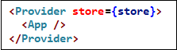<o:p></o:p>

    
<![if !supportLists]>2.&nbsp;<![endif]>connect：用于包装 UI 组件生成容器组件<o:p></o:p>

    
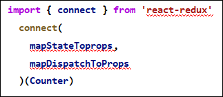<b><o:p></o:p></b>

    
<![if !supportLists]>3.&nbsp;<![endif]>mapStateToprops：将外部的数据（即state对象）转换为UI组件的标签属性<o:p></o:p>

    
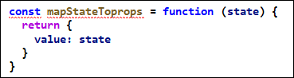<b><o:p></o:p></b>

    
<![if !supportLists]>4.&nbsp;<![endif]>mapDispatchToProps：将分发action的函数转换为UI组件的标签属性<o:p></o:p>

    <h2><b>7.7. </b><b>使用上</b><b>redux</b><b>调试工具</b><b><o:p></o:p></b></h2>
    <h3 style="text-indent:21.0000pt;"><b>7.7.1. </b><b>安装</b><b>chrome</b><b>浏览器插件</b><b><o:p></o:p></b></h3>
    
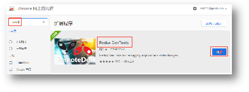<o:p>&nbsp;</o:p>

    <h3 style="text-indent:21.0000pt;"><b>7.7.2. </b><b>下载工具依赖包</b><b><o:p></o:p></b></h3>
    
&#9;npm install --save-dev redux-devtools-extension<o:p></o:p>

    
<o:p>&nbsp;</o:p>

    <h2><b>7.8. </b><b>纯函数和高阶函数</b><b><o:p></o:p></b></h2>
    <h3 style="margin-left:22.0000pt;mso-para-margin-left:2.0000gd;"><b>7.8.1. </b><b>纯函数</b><b><o:p></o:p></b></h3>
    
<![if !supportLists]>1.&nbsp;<![endif]>一类特别的函数: 只要是同样的输入(实参)，必定得到同样的输出(返回)<o:p></o:p>

    
<![if !supportLists]>2.&nbsp;<![endif]>必须遵守以下一些约束&#160;&#160;<o:p></o:p>

    
<![if !supportLists]>1)&nbsp;<![endif]>不得改写参数数据<o:p></o:p>

    
<![if !supportLists]>2)&nbsp;<![endif]>不会产生任何副作用，例如网络请求，输入和输出设备<o:p></o:p>

    
<![if !supportLists]>3)&nbsp;<![endif]>不能调用Date.now()或者Math.random()等不纯的方法&#160;&#160;<o:p></o:p>

    
<![if !supportLists]>3.&nbsp;<![endif]>redux的reducer函数必须是一个纯函数<o:p></o:p>

    <h3 style="text-indent:21.2500pt;"><b>7.8.2. </b><b>高阶函数</b><b><o:p></o:p></b></h3>
    
<![if !supportLists]>1.&nbsp;<![endif]>理解: 一类特别的函数<o:p></o:p>

    
<![if !supportLists]>1)&nbsp;<![endif]>情况1: 参数是函数<o:p></o:p>

    
<![if !supportLists]>2)&nbsp;<![endif]>情况2: 返回是函数<o:p></o:p>

    
<![if !supportLists]>2.&nbsp;<![endif]>常见的高阶函数: <o:p></o:p>

    
<![if !supportLists]>1)&nbsp;<![endif]>定时器设置函数<o:p></o:p>

    
<![if !supportLists]>2)&nbsp;<![endif]>数组的forEach()/map()/filter()/reduce()/find()/bind()<o:p></o:p>

    
<![if !supportLists]>3)&nbsp;<![endif]>promise<o:p></o:p>

    
<![if !supportLists]>4)&nbsp;<![endif]>react-redux中的connect函数<o:p></o:p>

    
<![if !supportLists]>3.&nbsp;<![endif]>作用: 能实现更加动态, 更加可扩展的功能<o:p></o:p>

<!--EndFragment-->
