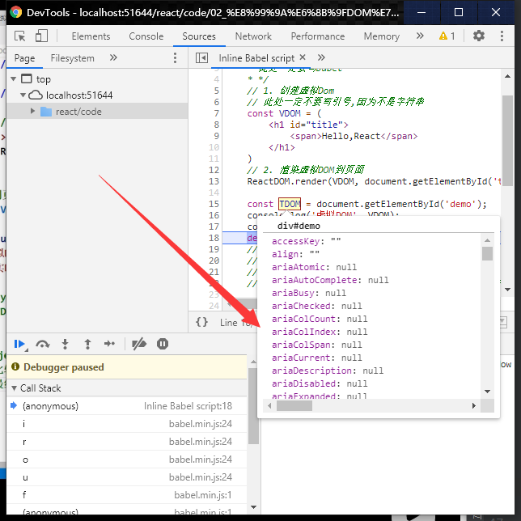
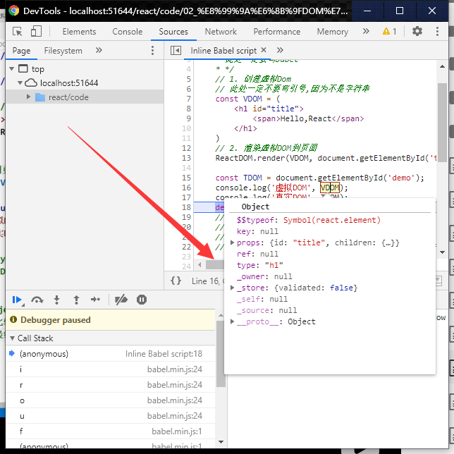

# 004_虚拟DOM与真实DOM

```html
<!doctype html>
<html lang="en">
<head>
    <meta charset="UTF-8">
    <meta name="viewport"
          content="width=device-width, user-scalable=no, initial-scale=1.0, maximum-scale=1.0, minimum-scale=1.0">
    <meta http-equiv="X-UA-Compatible" content="ie=edge">
    <title>3_虚拟DOM与真实DOM.html</title>
</head>
<body>
<!--准备好一个"容器""-->
<div id="test"></div>
<div id="demo"></div>
<!--引入 react 核心库-->
<script type="text/javascript" src="../js/react.development.js"></script>
<!--引入 react-dom ,用于支持react 操作Dom-->
<script type="text/javascript" src="../js/react-dom.development.js"></script>
<!--引入babel,用于将jsx转为js-->
<script type="text/javascript" src="../js/babel.min.js"></script>
<script type="text/babel">
    /*
    * 此处一定要写babel
    * */
    // 1. 创建虚拟Dom
    // 此处一定不要写引号,因为不是字符串
    const VDOM = (
        <h1 id="title">
            <span>Hello,React</span>    
        </h1>
    )   
    // 2. 渲染虚拟DOM到页面
    ReactDOM.render(VDOM, document.getElementById('test')); // 这个地方你不服

    const TDOM = document.getElementById('demo');
    console.log('虚拟DOM', VDOM);
    console.log('真实DOM', TDOM);
    debugger;
    // 关于虚拟DOM:
    // 1. 本质是Object类型的对象(一般对象)
    // 2. 虚拟DOM比较"轻"(身上的属性少),真实DOM比较重
    //    因为虚拟DOM是React内部在用,无需真实DOMname多的属性
    // 3. 虚拟DOM最终会被React 转化为真实DOM,呈现在页面上

</script>


</body>
</html>

```



