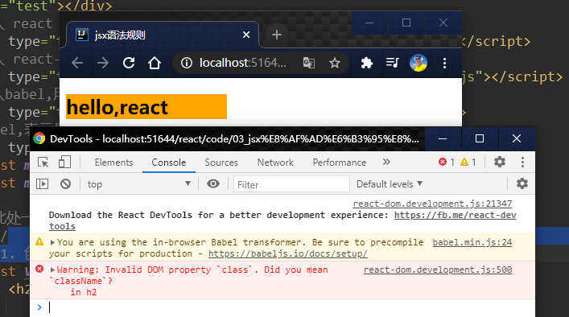

# 005_jsx语法规则

XML早期用于存储和传输数据

```xml
<student>
    <name>Tom</name>
    <age>19</age>
</student>
```

后来又有了json 了

```json
{
  "name":"Tom",
  "age":"19"
}
```

现在json比较NB,但是也不是也为这xml就不用了,你比如说微信公众号数据传输中还有在用的

    
## jsx语法规则:
1. 定义虚拟DOM时,不要写引号.
2. 标签中混入js表达式时,用{}
3. 样式的类名指定,不要用class,要用className.
4. 内联样式,要用style={ {key:'value',} }的形式写
5. 虚拟DOM,根标签只能有一个
6. 标签必须闭合
7. 标签首字母
    1. 若小写字母开头,则将该标签转为html中同名元素,若Html中该标签对应的无同名元素,则报错
    2. 若大写字母开头,React就去渲染对应的组件,若组件没有定义,则报错



```html
<!doctype html>
<html lang="en">
<head>
    <meta charset="UTF-8">
    <meta name="viewport"
          content="width=device-width, user-scalable=no, initial-scale=1.0, maximum-scale=1.0, minimum-scale=1.0">
    <meta http-equiv="X-UA-Compatible" content="ie=edge">
    <title>jsx语法规则</title>
    <style>
        .title{
            background-color: orange;
            width: 200px;
        }
    </style>
</head>
<body>
<!--准备好一个"容器""-->
<div id="test"></div>
<!--引入 react 核心库-->
<script type="text/javascript" src="../js/react.development.js"></script>
<!--引入 react-dom ,用于支持react 操作Dom-->
<script type="text/javascript" src="../js/react-dom.development.js"></script>
<!--引入babel,用于将jsx转为js-->
<script type="text/javascript" src="../js/babel.min.js"></script>
<!--babel,表示是jsx-->
<script type="text/babel">
    const myId = 'aTgUiGu'
    const myData = 'HeLlo,rEaCt'
    /*
    * 此处一定要写babel
    * */
    // 1. 创建虚拟Dom// 此处一定不要写引号,因为不是字符串
    const VDOM = (
        <div>
            <h2 class='title' id={myId.toLowerCase()}>
                <span style={ {color:'white' ,fontSize:'40px'} }>{myData.toLowerCase()}</span>
            </h2>
            <h2 class='title' id={myId.toUpperCase()}>
                <span style={ {color:'white' ,fontSize:'40px'} }>{myData.toLowerCase()}</span>
            </h2>
            <input type="text"/>
            <good>22268</good>
            <Good>22268</Good>

        </div>
    )
    /*react-dom.development.js:500 Warning: The tag <good> is unrecognized in this browser. If you meant to render a React component, start its name with an uppercase letter.
    in good
    in div*/
    // 2. 渲染虚拟DOM到页面
    ReactDOM.render(VDOM, document.getElementById('test')); // 这个地方你不服
    /*
    * jsx语法规则:
    *   1. 定义虚拟DOM时,不要写引号.
    *   2. 标签中混入js表达式时,用{}
    *   3. 样式的类名指定,不要用class,要用className.
    *   4. 内联样式,要用style={ {key:'value',} }的形式写
    *   5. 虚拟DOM,根标签只能有一个
    *   6. 标签必须闭合
    *   7. 标签首字母
    *       1. 若小写字母开头,则将该标签转为html中同名元素,若Html中该标签对应的无同名元素,则报错
    *       2. 若大写字母开头,React就去渲染对应的组件,若组件没有定义,则报错
    *
    * */
</script>

</body>
</html>

```