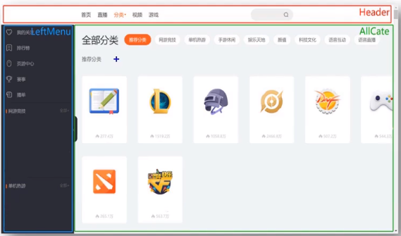

# 007_组件与模块

我一开始有一个`index.js`

然后我代码越写越多,

就可以分成 `a.js`,`b.js`

## 模块
1. 理解：向外提供特定功能的js程序, 一般就是一个js文件
2. 为什么要拆成模块：随着业务逻辑增加，代码越来越多且复杂。
3. 作用：复用js, 简化js的编写, 提高js运行效率

## 组件
1. 理解：用来实现局部功能效果的代码和资源的集合(html/css/js/image等等)
2. 为什么要用组件：一个界面的功能更复杂
3. 作用：复用编码, 简化项目编码, 提高运行效率

