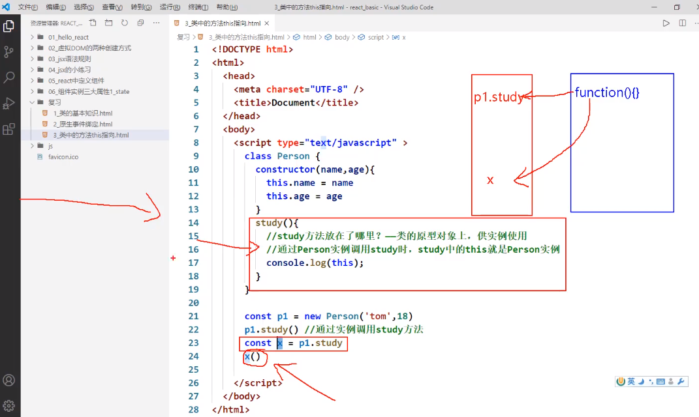

# 015_类中方法中的this


```html
<!doctype html>
<html lang="en">
<head>
    <meta charset="UTF-8">
    <meta name="viewport"
          content="width=device-width, user-scalable=no, initial-scale=1.0, maximum-scale=1.0, minimum-scale=1.0">
    <meta http-equiv="X-UA-Compatible" content="ie=edge">
    <title>Document</title>
</head>
<body>
<script type="application/javascript">
    class Person{
        constructor(name, age) {
            //
            this.name = name;
            this.age = age;
        }

        speak() {
            console.log(this);
        }
    }

    const p1 = new Person("张三",18);
    p1.speak()
    
    ///Person {name: "张三", aeg: 18}
    // aeg: 18
// name: "张三"
// __proto__: Object
    const x = p1.study  //这行没有调用
    // study 放在了哪里? - 类的原型对象上,供实例使用
    x() // 这个直接调用

</script>

</body>
</html>
```


>类中所有你定义的方法他在局部都开启的严格模式
>

>类帮你自动开的




## 局部严格模式


```html
<!doctype html>
<html lang="en">
<head>
    <meta charset="UTF-8">
    <meta name="viewport"
          content="width=device-width, user-scalable=no, initial-scale=1.0, maximum-scale=1.0, minimum-scale=1.0">
    <meta http-equiv="X-UA-Compatible" content="ie=edge">
    <title>06_组件实例三大属性1_state.html.html.html</title>
    <!--引入 react 核心库-->

    <script type="text/javascript" src="../js/react.development.js"></script>
    <!--引入 react-dom ,用于支持react 操作Dom-->
    <script type="text/javascript" src="../js/react-dom.development.js"></script>
    <!--引入babel,用于将jsx转为js-->
    <script type="text/javascript" src="../js/babel.min.js"></script>
</head>
<body>
<!--准备好一个"容器""-->
<div id="test"></div>
<!--
react 中 他重新封装了这些事件, 他
-->
<button></button>
<!--babel,表示是jsx-->
<script type="text/babel">
    // 1. 创建组件
    class Weather extends React.Component {
        constructor(props) {
            super(props);
            // 初始化状态
            this.state = {isHot: false}
        }

        render() {
            console.log(this);
            // 读取状态
            const {isHot} = this.state.isHot
            return <h1 onClick={this.changeWeather}>今天天气很{isHot ? '炎热' : '凉爽'}</h1>
            //onClick 要大写的C
            //    这里demo不能写括号
        }

        // document 这里你就尽量只是在这里写一次 document
        changeWeather() {
            // changeWeather 放在哪里? - weather房子啊了原型上 ,公实例使用
            // 由于changeWeather是作为onClick的回调,所以不是通过实例调用的,是直接调用
            // 然后由于类中的方法默认开启了局部的严格模式,所以changeWeather中的this为undefined
            console.log(this);  // 报错
        }
    }

    // 2.  渲染 组件到页面
    ReactDOM.render(<Weather/>, document.getElementById('test'));

</script>


</body>
</html>

```
