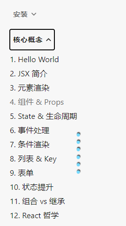

# 028_回调形式的ref


前面讲的字符串形式的ref已经不被react官方所建议使用了

而且官方说,在更新有可能给他废弃掉



官方的这个教程的顺序,对于初学者不是很友好

有很多概念需要互相理解


官方文档:[refs](https://react.docschina.org/docs/refs-and-the-dom.html)


### 过时 API：String 类型的 Refs

如果你之前使用过 React，你可能了解过之前的 API 中的 string 类型的 ref 属性，例如 `"textInput"`。你可以通过 `this.refs.textInput` 来访问 DOM 节点。我们不建议使用它，因为 string 类型的 refs 存在 [一些问题](https://github.com/facebook/react/pull/8333#issuecomment-271648615)。它已过时并可能会在未来的版本被移除。

> 注意
>
> 如果你目前还在使用 `this.refs.textInput` 这种方式访问 refs ，我们建议用[回调函数](https://react.docschina.org/docs/refs-and-the-dom.html#callback-refs)或 [`createRef` API](https://react.docschina.org/docs/refs-and-the-dom.html#creating-refs) 的方式代替。

## 一句话

字符串类型,会导致效率问题,官方没有具体说明,总之能不用就不用吧!


回调函数:

1. 你定义的函数
2. 你没有调用
3. 有人调用了

## 代码


```html
<!DOCTYPE html>
<html lang="en">
<head>
    <meta charset="UTF-8">
    <title>1_字符串形式的ref</title>
</head>
<body>
<!-- 准备好一个“容器” -->
<div id="test"></div>
<!-- 引入react核心库 -->
<script type="text/javascript" src="../js/react.development.js"></script>
<!-- 引入react-dom，用于支持react操作DOM -->
<script type="text/javascript" src="../js/react-dom.development.js"></script>
<!-- 引入babel，用于将jsx转为js -->
<script type="text/javascript" src="../js/babel.min.js"></script>

<script type="text/babel">
    //创建组件
    class Demo extends React.Component {
        //展示左侧输入框的数据
        showData = () => {
            const {input1} = this
            alert(input1.value)
        }
        //展示右侧输入框的数据
        showData2 = () => {
            const {input2} = this
            alert(input2.value)
        }

        render() {
            return (
                <div>
                    <input ref={c => this.input1 = c} type="text" placeholder="点击按钮提示数据"/>&nbsp;
                    <button onClick={this.showData}>点我提示左侧的数据</button>
                    &nbsp;
                    <input onBlur={this.showData2} ref={c => this.input2 = c} type="text" placeholder="失去焦点提示数据"/>&nbsp;
                </div>
            )
        }

        //ref={c => this.input1 = c} 这个函数是一个回调函数
		// 你只需要吧这个函数写在这里
		// react 会帮你调用这个函数的
		// 这里只能写ref,不能写别的,才能被扫到
		// 还吧ref当前这个节点,传递进去,作为一个实参
    }

    //渲染组件到页面
    ReactDOM.render(<Demo a="1" b="2"/>, document.getElementById('test'))
</script>
</body>
</html>
```