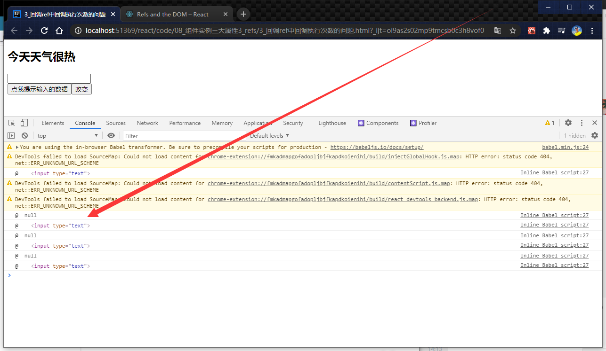

# 029_回调ref中调用次数的问题

[官网](https://react.docschina.org/docs/refs-and-the-dom.html#caveats-with-callback-refs)中说:

### 关于回调 refs 的说明

如果 `ref` 回调函数是以内联函数的方式定义的，在更新过程中它会被执行两次，第一次传入参数 `null`，然后第二次会传入参数 DOM 元素。这是因为在每次渲染时会创建一个新的函数实例，所以 React 清空旧的 ref 并且设置新的。通过将 ref 的回调函数定义成 class 的绑定函数的方式可以避免上述问题，但是大多数情况下它是无关紧要的。


> 上面说的是更新的时候调用
>
>而一开始初始化的时候没有更新也就不会被调用2次
>
>状态切换才是组件的更新,你正常进行的交互不算更新

```js
//创建组件
class Demo extends React.Component {
    state = {
        isHot: false,
    }

    showInfo = () => {
        const {input1} = this
        alert(input1.value)
    }
    // changeWeather = () =>{}
    // 这种状态形式
    changeWeather = () => {
        // 获取原来的状态
        const {isHot} = this.isHot
        this.setState({isHot: !isHot})
    }

    render() {
        const {isHot} = this.state
        return (
            <div>
                <h2>今天天气很{isHot ? "热" : "凉"}</h2>
                <input ref={(currentNode) => {
                    this.input1 = currentNode
                    console.log("@ ", currentNode);
                }} type="text"/><br/>
                <button onClick={this.showInfo}>点我提示输入的数据</button>

                <button onClick={this.changeWeather}>改变</button>
            </div>
        )
    }
}

//渲染组件到页面
ReactDOM.render(<Demo/>, document.getElementById('test'))
```


> 除了初始化的那次,每点击一次,都调用2次,第一次null,第二次才有值



弹幕: 原来是react官方的bug

回复: 兄弟,官方的bug人家不叫bug,叫特性


> 通过将 ref 的回调函数定义成 class 的绑定函数的方式可以避免上述问题

官方的这句话,晦涩难懂

看下面代码演示


## 代码
```javascript
//创建组件
class Demo extends React.Component {
    state = {
        isHot: false,
    }

    showInfo = () => {
        const {input1} = this
        alert(input1.value)
    }
    // changeWeather = () =>{}
    // 这种状态形式
    changeWeather = () => {
        // 获取原来的状态
        const {isHot} = this.state
        this.setState({isHot: !isHot})
    }

    saveInput = (c) => {
        this.input1 = c;
        console.log('@',c);
    };

    render() {
        const {isHot} = this.state
        return (
            <div>
                <h2>今天天气很{isHot ? "热" : "凉"}</h2>
                {/*<input ref={(currentNode) => {
                    this.input1 = currentNode
                    console.log("@ ", currentNode);
                }} type="text"/><br/>*/}
                <input ref={this.saveInput} type="text"/><br/>
                <button onClick={this.showInfo}>点我提示输入的数据</button>

                <button onClick={this.changeWeather}>改变</button>
            </div>
        )
    }
}

//渲染组件到页面
ReactDOM.render(<Demo/>, document.getElementById('test'))
```

>官方说了,这个没什么影响
>
