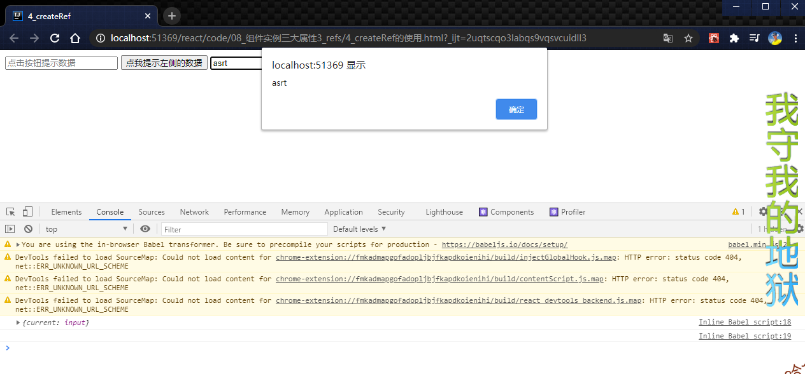

# 030_createRef的使用

```javascript
//创建组件
class Demo extends React.Component {
    /*
    * React.createRef 调用后 可以返回一个容器,该容器可以存储被ref所标识的节点
    * 该容器是专人专用的
    * 里面其实她只能存储一个
    * */
    myRef = React.createRef();
    myRef2 = React.createRef();
    showData = () => {
        console.log(this.myRef);
        console.log(this.myRef.current);
        alert(this.myRef.current.value);
    }
    //展示右侧输入框的数据
    showData2 = () => {
        console.log(this.myRef2);
        console.log(this.myRef2.current);
        alert(this.myRef2.current.value);
    }

    render() {
        return (
            <div>
                <input ref={this.myRef} type="text" placeholder="点击按钮提示数据"/>&nbsp;
                <button onClick={this.showData}>点我提示左侧的数据</button>
                &nbsp;
                <input onBlur={this.showData2} ref={this.myRef2} type="text" placeholder="失去焦点提示数据"/>&nbsp;
            </div>
        )
    }
}

//渲染组件到页面
ReactDOM.render(<Demo a="1" b="2"/>, document.getElementById('test'))
```

