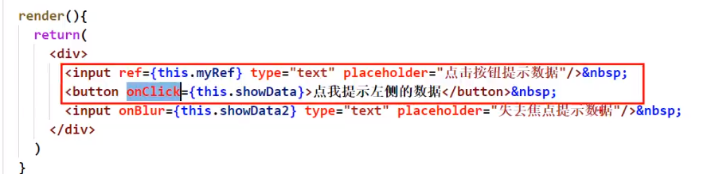

# 032_react中的事件处理

 

1. 通过onXxx属性指定事件处理函数(注意大小写)
    1. React使用的是自定义(合成)事件, 而不是使用的原生DOM事件 —————— 为了更好的兼容性
    2. React中的事件是通过事件委托方式处理的(委托给组件最外层的元素) ———————为了的高效
2. 通过event.target得到发生事件的DOM元素对象 ——————————[不要过度使用ref](https://react.docschina.org/docs/refs-and-the-dom.html#dont-overuse-refs)

> React 你别动不动就写ref
>
>有些时候,你这个ref是可以省略的
>
发生事件的DOM元素和你要操作的元素是一个

你就可以省略ref

