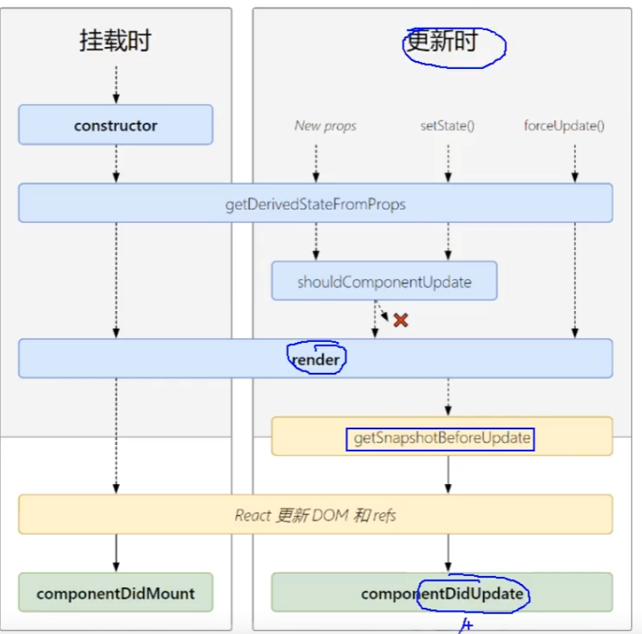
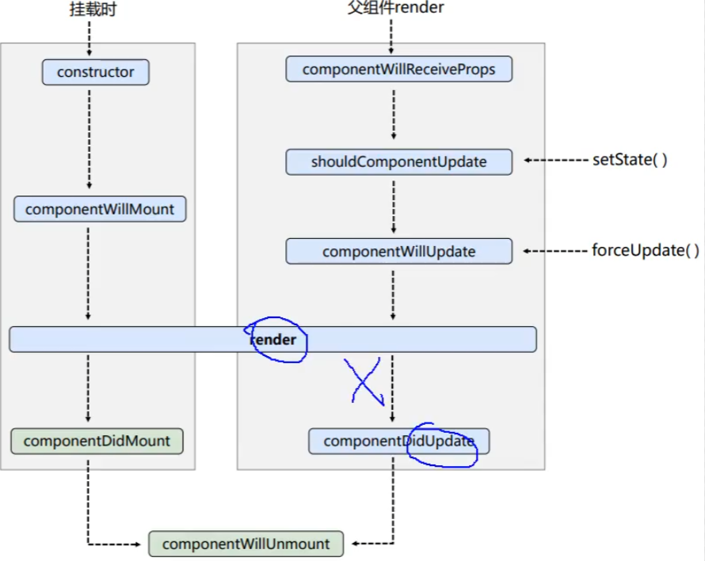

# 045 getSnapshotBeforeUpdate

`getSnapshotBeforeUpdate`比之前内个有点儿意义,刚才内个内写完了还违背了一些原则,有搭建了一些环境才搞出来了,然后还引发出了一些问题,就就就 ... 就™离谱

## 看一下新的图



## 旧的图




我先把上一个函数 ,让他返回null,但是我还不给他删除掉,不然你总是感觉没有走式的

```javascript
static getDerivedStateFromProps(props,state) {
    // 如果当真
    console.log("get|DerivedStateFromProps",props,state);
    return null;
}
```

## 翻译

Snapshot ==> 快照

getSnapshotBeforeUpdate ===> 在更新之前获取快照


上代码测试

```javascript
getSnapshotBeforeUpdate() {
    console.log("getSnapshotBeforeUpdate");
}
```

然后他报错

```
react_devtools_backend.js:2450 Warning: Count.getSnapshotBeforeUpdate(): A snapshot value (or null) must be returned. You have returned undefined.
    at Count (<anonymous>:17:9)
```

解决一下

```javascript
getSnapshotBeforeUpdate() {
    console.log("getSnapshotBeforeUpdate");
    return null;
}	
```

所以看[官方](https://react.docschina.org/docs/react-component.html#getsnapshotbeforeupdate)这么说的

### `getSnapshotBeforeUpdate()`

```
getSnapshotBeforeUpdate(prevProps, prevState)
```

`getSnapshotBeforeUpdate()` 在最近一次渲染输出（提交到 DOM 节点）之前调用。它使得组件能在发生更改之前从 DOM 中捕获一些信息（例如，滚动位置）。此生命周期的任何返回值将作为参数传递给 `componentDidUpdate()`。

此用法并不常见，但它可能出现在 UI 处理中，如需要以特殊方式处理滚动位置的聊天线程等。

应返回 snapshot 的值（或 `null`）。