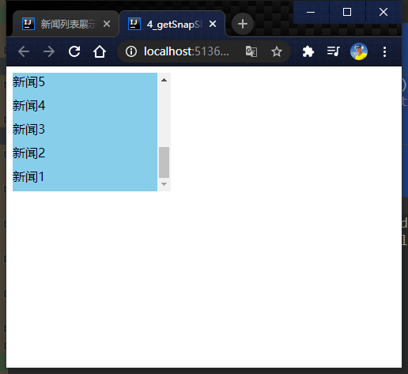

# 046_getSnapshotBeforeUpadate案例

```javascript
class NewsList extends React.Component {

    state = {newsArr: []}

    // 组件挂载完毕的钩子
    componentDidMount() {
        setInterval(() => {
            //获取原状态
            const {newsArr} = this.state
            //模拟一条新闻
            const news = '新闻' + (newsArr.length + 1)
            //更新状态
            this.setState({newsArr: [news, ...newsArr]})
        }, 1000);
    }

    getSnapshotBeforeUpdate() {
        // 返回 高度
        return this.refs.list.scrollHeight
    }

    componentDidUpdate(preProps, preState, height) {
        this.refs.list.scrollTop += this.refs.list.scrollHeight - height
    }

    render() {
        return (
            <div className="list" ref="list">
                {
                    this.state.newsArr.map((n, index) => {
                        return <div key={index} className="news">{n}</div>
                    })
                }
            </div>
        )
    }
}

ReactDOM.render(<NewsList/>, document.getElementById('test'))
```



